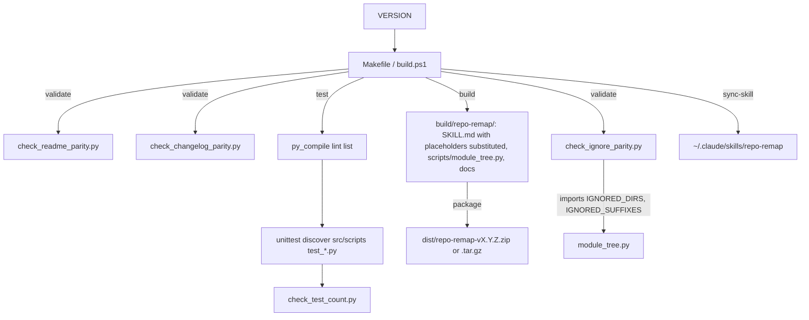

# repo-remap

Path: `.` (repo root)
Purpose: Build, version, gate and test the Repo Remap Claude Code skill, which rebuilds a repo's docs bottom-up as self-contained `README.md` (people) and `CLAUDE.md` (Claude) files.

## Scope

The skill is one protocol file (`src/SKILL.md`) plus one Python script (`src/scripts/module_tree.py`). Leaves are documented first from their source; each parent is written from its children's finished docs. Use cases: stale docs after a refactor, repos with no per-module docs, onboarding a person or an agent.

Here at the root: build channels, version and test-count files, changelog, license, user README.

| Path | What it is |
| --- | --- |
| `src/SKILL.md` | Protocol: frontmatter, Definitions, Workflow (Step 0, Pass 1 to 3), Self-containment, README.md and CLAUDE.md formats, Style constraints, Reporting back, Checklist |
| `src/scripts/module_tree.py` | Shipped mapper: prints qualifying modules deepest first. Stdlib only, read-only |
| `src/scripts/check_*.py` | Dev-only gates (4) |
| `src/scripts/test_*.py` | Dev-only unittest suites (6, 75 tests) |
| `README.md` | User docs. Carries gated badges and the gated "Ignored by default" paragraph. Shipped |
| `VERSION` | Single source of truth for the version (`1.0.0`). Shipped |
| `TEST_COUNT` | Live unittest pass count (`75`) |
| `CHANGELOG.md` | Keep a Changelog. Top entry must equal `VERSION`. No `[Unreleased]` section. Shipped |
| `LICENSE` | Apache 2.0. Shipped |
| `Makefile` | Unix/Linux/macOS build channel |
| `build.ps1` | Windows PowerShell 7+ build channel |

Only `SKILL.md`, `scripts/module_tree.py`, `README.md`, `LICENSE`, `CHANGELOG.md` and `VERSION` ship.

## Architecture



Runtime (installed skill): Claude reads `SKILL.md`, Step 0 runs `python3 <skill-path>/scripts/module_tree.py <repo-root>`, then Pass 1 writes leaves deepest first, Pass 2 and 3 write parents up to the root.

## Public interface

### Build targets (same names in both channels)

| Make | PowerShell | Does |
| --- | --- | --- |
| `make build` | `.\build.ps1 build` | Stage `build/repo-remap/`, substitute `__SKILL_VERSION__` (from `VERSION`), `__SKILL_DATE__` (UTC `YYYY-MM-DD`), `__SKILL_COMMIT__` (`git rev-parse --short HEAD`) |
| `make build-combined` | `build-combined` | `build/repo-remap-combined.md`: `SKILL.md` plus trailing `---` and a Note saying no script ships |
| `make package` (default) | `package` (default) | validate, build, zip to `dist/` |
| `make package-combined` | `package-combined` | validate, build-combined, copy to `dist/` |
| `make package-tar` | `package-tar` | validate, build, tarball to `dist/` |
| `make validate` | `validate` | Frontmatter keys, placeholders, script citations, three parity gates. Fast, suite-free |
| `make lint` | `lint` | `py_compile` every `src/scripts/*.py` |
| `make test` | `test` | lint, unittest discovery, `check_test_count.py` |
| `make clean` | `clean` | Remove `build/`, `dist/`, `src/scripts/__pycache__` |
| `make list` | `list` | build, then list package files |
| `make sync-skill` | `sync-skill` | Deploy to `~/.claude/skills/repo-remap` with prune |
| `make help` | `help` | Target list |

Python is `python3`; override with `PYTHON=... make test` or `$env:PYTHON`. `build.ps1` exits 1 on an unknown command.

### Mapper

```bash
python3 src/scripts/module_tree.py <repo-root>                         # processing order, deepest first
python3 src/scripts/module_tree.py <repo-root> --min-files 3           # coarser tree
python3 src/scripts/module_tree.py <repo-root> --ignore fixtures generated
```

Exit 1 if root is not a directory, 0 otherwise. Never writes files. A dir qualifies with more than N (default 2) direct counted files or a qualifying child; root always qualifies; dirs with no counted files anywhere below are dropped.

### Gates

Each `src/scripts/check_*.py` takes an optional root argument (default: repo root), prints `PASS ...` or `FAIL [<tag>] ...`, exits 0 or 1.

### Activation triggers

"remap this repo", "the docs are out of date", "document every module", "generate CLAUDE.md files across the codebase", "re-onboard me to this project".

## Data shapes

- `VERSION`: one line `X.Y.Z`.
- `TEST_COUNT`: one integer line.
- `CHANGELOG.md` heading: `## [X.Y.Z] - YYYY-MM-DD`; the first match must equal `VERSION`.
- README version badge: ``. Tests badge: ``. Matched as whole badges.
- README ignore paragraph: starts with `**Ignored by default**`, backticks every non-dotted `IGNORED_DIRS` entry and every `IGNORED_SUFFIXES` entry, contains `Dotted directories are skipped except `.github``, at least 10 backticked names, nothing unknown.
- `SKILL.md` frontmatter: `name`, `description`, `version: __SKILL_VERSION__`, `released: __SKILL_DATE__`, `commit: __SKILL_COMMIT__`.

## Invariants and constraints

- `src/SKILL.md` keeps `name:`, `description:` and the three `__SKILL_*__` placeholders. Never write a literal version there. After `make build`, `grep -c __SKILL_ build/repo-remap/SKILL.md` is 0.
- Every `scripts/<x>.py` cited in `SKILL.md` must exist under `src/scripts/` (validate checks).
- `SKILL.md` Definitions must match `module_tree.qualifying`: more than N direct files, or a qualifying descendant; root always qualifies.
- `IGNORED_DIRS`, `IGNORED_FILES`, `IGNORED_SUFFIXES` in `module_tree.py` are restated in the README "Ignored by default" paragraph (gated, dirs and suffixes only) and in `SKILL.md` Definitions (not gated). The `SKILL.md` list is a subset and names "lockfile-only dirs", which the code does not implement.
- `module_tree.py`: Python 3.8+, standard library only. No pip dependencies anywhere, no linters that need installing.
- `Makefile` and `build.ps1` are one fact in two places. Any change to a target, gate invocation, lint list, test command or combined-file Note goes in both; `test_build_channels.py` fails on drift.
- `SCRIPT_FILES` (Makefile) and `$ScriptFiles` (build.ps1) name only `src/scripts/module_tree.py`. `make list` must show no `check_*.py` or `test_*.py`.
- `check_test_count.py` runs under `test` only, never `validate`.
- Badge regexes stay whole-badge; never loosen to substring.
- A missing or unparseable `CHANGELOG.md` is FAIL, not skip.
- Makefile loops use `|| { echo ...; exit 1; }`, never `|| ( ... exit 1 )`: `exit 1` in a subshell ends only the subshell and a `for` loop's status is its last iteration's. Probe any repair with a failing non-last entry. `test_makefile_loops_use_brace_groups` rejects `|| (` on non-comment lines.
- `build.ps1` starts with `#Requires -Version 7`, names `-Encoding utf8` on every `Get-Content`/`Set-Content`, never wraps a gate in `Test-Path`, and exits 1 on an unknown command.
- Style of generated docs (and of this repo's docs): plain language, no emojis, no em dashes, no preambles or closing summaries.

## Dependencies

- Python 3.8+ (stdlib only), GNU make, `git` (build targets call `git rev-parse`), `zip`, `tar`, `sed`, `diff`.
- PowerShell 7+ for `build.ps1`.
- The Makefile uses GNU `sed -i "..."`; BSD `sed` on stock macOS expects a suffix after `-i`.

## Failure modes

- `validate`: `ERROR: <reason>` and exit 1 for missing `SKILL.md`, frontmatter key, placeholder, cited script, or `src/scripts/`; each gate prints `FAIL [<tag>]` and fails the target.
- `test`: syntax error stops at lint; any failing test stops unittest; `FAIL [test-count-drift] TEST_COUNT is X, live run passed Y` when counts diverge.
- Three suites include `test_live_repo_passes`, so badge, changelog or ignore-paragraph drift in the real repo fails the suite, not only `validate`.
- `sync-skill`: `ERROR: sync-skill shipped dev-only scripts into the install` if a `test_*.py` or `check_*.py` lands in the install; `ERROR: sync diff mismatch` if `SKILL.md`, `module_tree.py` or `VERSION` differ after copy. `README.md`, `LICENSE`, `CHANGELOG.md` are copied but not compared.
- Build outside a git checkout fails at `git rev-parse`.

## Working here

### Release

1. Bump `VERSION`.
2. Add a `## [X.Y.Z] - YYYY-MM-DD` entry at the top of `CHANGELOG.md`.
3. Update the README version badge.
4. `make validate && make test`.

### After adding or removing tests

Run `python3 -m unittest discover -s src/scripts -p "test_*.py"`, write the `Ran N tests` number to `TEST_COUNT`, update the README tests badge and the per-suite counts in the README Contributing section (prose, not gated).

### Adding a script under src/scripts

Add it to the lint list in the Makefile `lint` target and `$LintFiles` in `build.ps1`; the lockstep test compares both to the live `src/scripts/*.py` set. Do not add it to `SCRIPT_FILES`/`$ScriptFiles` unless it must ship, and then update the lockstep test too.

### Commit subjects

Bracketed area tag: `[skill] ...`, `[script] ...`, `[build] ...`, `[docs] ...`. No Claude attribution lines.

### Validation checklist

- [ ] `make validate` passes
- [ ] `make test` passes and `TEST_COUNT` equals the live `Ran N tests`
- [ ] README version and tests badges match `VERSION` and `TEST_COUNT`
- [ ] `CHANGELOG.md` first entry equals `VERSION`
- [ ] README "Ignored by default" paragraph agrees with `IGNORED_DIRS` and `IGNORED_SUFFIXES`
- [ ] `src/SKILL.md` has `name:`, `description:` and the three placeholders; cited scripts exist
- [ ] `SKILL.md` Definitions match the qualifying logic in `module_tree.py`
- [ ] `make list` shows no `check_*.py` or `test_*.py`
- [ ] `grep -c __SKILL_ build/repo-remap/SKILL.md` is 0 after `make build`
- [ ] PowerShell claims verified by reading `build.ps1` and by `test_build_channels.py`, not by running it (no PowerShell in the usual dev environment). Say so when reporting

### Updating the local skill

When asked to "update local skill", run the sync target. This is the procedure, not one option among several:

```bash
make sync-skill          # Unix/Linux/macOS
.\build.ps1 sync-skill   # Windows
```

It deletes `~/.claude/skills/repo-remap/scripts/*.py`, copies `SKILL.md`, `module_tree.py`, `README.md`, `LICENSE`, `CHANGELOG.md` and `VERSION`, refuses if a dev-only script leaked into the install, and compares `SKILL.md`, `module_tree.py` and `VERSION` with the source. Prune-before-copy is the point: `cp` alone cannot remove a file deleted from the repo.

Fallback (no prune) if make and PowerShell are unavailable:

```bash
mkdir -p ~/.claude/skills/repo-remap/scripts
cp src/SKILL.md ~/.claude/skills/repo-remap/SKILL.md
cp src/scripts/module_tree.py ~/.claude/skills/repo-remap/scripts/    # never check_*.py or test_*.py
cp README.md LICENSE CHANGELOG.md VERSION ~/.claude/skills/repo-remap/
diff -q src/SKILL.md ~/.claude/skills/repo-remap/SKILL.md
diff -q src/scripts/module_tree.py ~/.claude/skills/repo-remap/scripts/module_tree.py
ls ~/.claude/skills/repo-remap/scripts/                                 # must list module_tree.py only
```

Any file present only in the install is an orphan the fallback cannot remove; delete it by hand.
