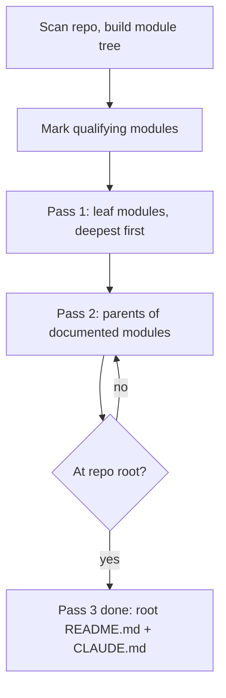

# Repo Remap

[](LICENSE)
[](CHANGELOG.md)
[](src/scripts/test_module_tree.py)
[](src/scripts/module_tree.py)
[](https://www.electiconsulting.com)

**A [Claude Code](https://docs.anthropic.com/en/docs/claude-code) skill that rebuilds a repository's documentation as a bottom-up tree of self-contained `README.md` and `CLAUDE.md` files.**

Documentation rots quietly. The root README was true two refactors ago. Half the subdirectories have no docs at all, and the ones that do describe a module that has since been split, renamed, or gutted. Nobody notices until someone acts on it: a new hire wires up an interface that no longer exists, or an agent reads a confident, stale paragraph and builds on top of a lie.

The usual fix makes it worse. Someone asks a model to "document the repo", it reads the top-level files, and writes downward. Every child description is a guess extrapolated from a directory name. The docs get longer, the error rate stays the same, and now the wrong information is spread across more files.

Repo Remap inverts the direction. It maps the repo into modules, orders them deepest first, and writes the leaves before anything above them. A parent is written from its children's finished docs plus its own source files, so information is summarized upward from things that were actually read, never guessed downward from things that were not.

> Write the leaves first. Every layer above summarizes text that already exists, not a directory name it hopes to understand.

Each documented directory gets exactly two files, because the two readers want opposite things. `README.md` is for a person who has never seen the code: plain words, short sentences, the shape of the problem. `CLAUDE.md` is for an agent working inside that directory right now: paths, signatures, data shapes, invariants, failure modes, and the rules for changing the code.

Both are self-contained. No file points at another file in the tree. Open any single one of them and you can act.

---

## At a Glance

Say "remap this repo" and here is what actually happens:

- The repo is scanned into a module tree, with trivial and ignored directories filtered out.
- You get the module list back before anything is written if the repo is large, so you can exclude areas.
- Leaf modules are documented first, from their source files, not from their old docs.
- Each level up is written from its children's finished docs, ending at the repo root.
- Existing `README.md` and `CLAUDE.md` files are treated as claims to verify, then overwritten.

This is one skill file plus one Python script with no dependencies. See [Get Started](#get-started-in-60-seconds) to install it, and [A Worked Example](#a-worked-example) to watch a full run.

## Table of Contents

**Start here**

- [When to Use This](#when-to-use-this)
- [Get Started in 60 Seconds](#get-started-in-60-seconds)
- [A Worked Example](#a-worked-example)
- [Why This Works](#why-this-works)

**Reference**
[How It Works](#how-it-works) ·
[The Module Tree Script](#the-module-tree-script) ·
[Self-Containment](#self-containment) ·
[Document Contracts](#document-contracts) ·
[Style Constraints](#style-constraints) ·
[FAQ](#faq)

**Project**
[Project Structure](#project-structure) ·
[Contributing](#contributing) ·
[Sponsored by](#sponsored-by) ·
[License](#license)

---

## When to Use This

Reach for it when the map of the codebase is missing or wrong. Skip it when you need one file explained, not the territory.

| Use it | Skip it |
| --- | --- |
| Docs are stale after a large refactor or migration | A single function or file needs a comment |
| A repo has no per-module documentation at all | The repo is one flat directory of three files |
| You are starting work in an unfamiliar codebase | You already know the code and need a quick fix |
| Agents keep acting on outdated README claims | You want API reference generated from docstrings |
| Onboarding a new person or a new agent to the system | You want a changelog, ADR, or design proposal |
| You want `CLAUDE.md` files across the whole tree | You want prose marketing copy about the project |

**Trigger phrases**: *"remap this repo"*, *"the docs are out of date"*, *"document every module"*, *"generate CLAUDE.md files across the codebase"*, *"re-onboard me to this project"*.

---

## Get Started in 60 Seconds

**Requires**: Python 3.8+ for the mapping script. Standard library only, no `pip install`.

### Option 1: Zip package (recommended)

Download `repo-remap-v*.zip` from the [GitHub Releases](https://github.com/NikolasMarkou/repo-remap/releases) page and unpack it into your skills directory:

```bash
unzip repo-remap-v*.zip -d ~/.claude/skills/
```

You get `~/.claude/skills/repo-remap/` with `SKILL.md`, `scripts/module_tree.py`, and the docs. Nothing else is needed at runtime. For a project-local install, unpack into `.claude/skills/` inside that project instead.

### Option 2: Single-file skill

Download `repo-remap-combined.md` from the same release and paste it into your custom instructions. It is the protocol only: the mapping script is not included, so Claude builds the module list by hand as described in Step 0. Everything else works the same.

### Option 3: Clone and build

```bash
git clone https://github.com/NikolasMarkou/repo-remap.git
cd repo-remap
make build
cp -r build/repo-remap ~/.claude/skills/
```

`make build` stamps the version, date and commit into `SKILL.md` and copies only the shipped files. To update a clone-based install later, use `make sync-skill`: it prunes the installed scripts before copying, so files deleted from the repo do not linger.

### Manual mapping

The skill degrades cleanly. If the script is unavailable, the protocol says to build the same module list by hand: list directories, count direct files, discard ignored paths, sort by depth descending.

### First run

In any project directory, say **"remap this repo"**. Claude runs the mapping script, confirms the module list with you if the repo is large, then walks the passes from the deepest leaves to the root.

---

## A Worked Example

One full run, condensed. This is the shape every remap takes.

> **You**: "The docs in this service are ancient. Remap this repo."

**Claude (Step 0: map)** runs the helper:

```bash
python3 ~/.claude/skills/repo-remap/scripts/module_tree.py .
```

Output, deepest first:

```
repo root: /home/dev/payments-api
qualifying modules: 9   skipped dirs: 4

PROCESSING ORDER (deepest first)

-- depth 2 --
  src/adapters/stripe          files=6    leaf [README]
  src/adapters/ledger          files=4    leaf

-- depth 1 --
  src/adapters                 files=1    parent of 2
  src/core                     files=7    leaf [README+CLAUDE]
  tests/integration            files=5    leaf

-- root --
  .                            files=3    parent of 3 [README]

SKIPPED (documented by nearest qualifying ancestor)
  src/adapters/stripe/fixtures files=2
```

Nine modules is under the confirmation threshold, so Claude proceeds.

**Pass 1 (leaves)** starts at `src/adapters/stripe`. Every direct source file is read in full: public API, entry points, side effects, error paths. The existing README there is read too, and treated as a set of claims. Two of them still hold, one describes a retry policy that was removed last year, so it goes. A new `README.md` and a new `CLAUDE.md` are written and the old file is overwritten completely. Then `src/adapters/ledger`, then `src/core`, then `tests/integration`.

**Pass 2 (one level up)** reaches `src/adapters`, whose children are now documented. Claude reads the module's own single file, then the finished `README.md` and `CLAUDE.md` of both children, then the skipped `fixtures/` directory, since nothing else will cover it. The parent docs state what each adapter is for and how the pieces connect. They do not restate the Stripe client's retry semantics: that already lives one level down, in full.

**Pass 3 (root)** writes the repo root last, from the finished docs of `src/adapters`, `src/core`, and `tests/integration`. It describes what the system is, how to run it, how the top-level pieces fit, and where the important behavior lives.

**Reporting back** is a file list grouped by pass. No narrative, no summary of what was learned, no commentary about the documentation itself.

---

## Why This Works

Four ideas separate this from "ask Claude to write some READMEs."

### 1. Direction of travel

Top-down documentation is extrapolation. The model reads the root, sees `src/adapters/`, and writes a sentence about adapters that sounds right. Bottom-up documentation is summarization. By the time the parent is written, its children's docs exist as text, produced from files that were actually opened. Summarizing existing text is a task models are reliable at. Guessing the contents of an unopened directory is not.

The ordering rule that enforces this is blunt: never document a parent before its children, and if a child is rewritten later, rewrite every ancestor above it.

### 2. Two readers, two documents

A README that satisfies a new engineer is bad context for an agent, and a file dense enough to be good agent context is unreadable for a person. Most projects compromise and produce one document that serves neither.

Repo Remap refuses the compromise. `README.md` explains the problem the module solves in plain language and shows how to run it. `CLAUDE.md` carries the path from repo root, the public interface with signatures, data shapes, invariants and ordering constraints, dependencies, failure modes, and the concrete rules for changing the code. Target around 200 lines, hard ceiling 300. When it will not fit, narrative gets cut and contracts stay.

### 3. Self-containment over cross-references

A documentation tree held together by links reads well in a browser and fails everywhere else. Agents load one file. People open one file. Grep returns one file.

So no file in the tree references another file in the tree. No "see the parent README", no "as described in `../core/CLAUDE.md`". Context a reader needs is repeated, and duplication across files is expected and correct here. Referring to source files by path is encouraged. Referring to other docs is not. Each file states what the module is and where it sits in the repo in its first lines, so it survives being read in isolation.

### 4. Not everything deserves a file

Documenting every directory produces noise that buries the real content. The qualifying rule keeps the tree honest:

| Term | Definition |
| --- | --- |
| **Module** | A directory containing source files, excluding ignored paths |
| **Direct files** | Source files directly inside the directory, not counting `README.md` and `CLAUDE.md` |
| **Leaf module** | A module with no child modules |
| **Qualifying module** | More than 2 direct files, or at least one qualifying descendant |
| **Skipped module** | 2 or fewer direct files and no qualifying descendant |

Skipped directories get no docs. Their contents are covered by the nearest qualifying ancestor, which reads them directly during its own pass. The repo root always qualifies, regardless of file count.

---

## How It Works

Three passes over a tree that was ordered once, at the start.



**No mermaid renderer? The same passes as a table**

| Step | What happens | Inputs read |
| --- | --- | --- |
| **Step 0** | Scan the repo, mark qualifying modules, order deepest first. Confirm the list with the user above roughly 25 modules. | Directory tree, file counts |
| **Pass 1** | Write both files for every qualifying leaf, deepest first. Overwrite old docs completely. | Every direct source file in the module, plus any existing docs treated as unverified claims |
| **Pass 2** | Write both files for every module whose children are all documented. Summarize children, do not copy them. | Own direct source files, children's finished docs, skipped child directories |
| **Pass 3** | Repeat Pass 2 one level at a time until the root is written. | Same as Pass 2, ending at the whole system |

**Ignored by default**: `.git`, `.hg`, `.svn`, `.idea`, `.vscode`, `__pycache__`, `node_modules`, `bower_components`, `vendor`, `venv`, `.venv`, `env`, `virtualenv`, `dist`, `build`, `out`, `target`, `.next`, `.nuxt`, `.svelte-kit`, `coverage`, `.terraform`, `.gradle`, `.tox`, `.cache`, `site-packages`, and caches such as `.pytest_cache`, `.mypy_cache`, `.ruff_cache`. Dotted directories are skipped except `.github`. Compiled and generated files (`.pyc`, `.pyo`, `.class`, `.o`, `.so`, `.dll`, `.dylib`, `.log`, `.lock`, `.map`, `.min.js`, `.min.css`, `.snap`) do not count toward the file total.

---

## The Module Tree Script

`src/scripts/module_tree.py` is a read-only mapper. It never writes documentation, it decides where documentation belongs.

```bash
python3 module_tree.py <repo-root> [--min-files N] [--ignore DIR ...]
```

| Flag | Effect |
| --- | --- |
| `--min-files N` | Modules with this many direct files or fewer are skipped. Default 2. Raise it on a sprawling repo to get a coarser tree. |
| `--ignore DIR ...` | Extra directory names added to the ignore set, matched by name at any depth. |

Output has three parts: a header with the qualifying and skipped counts, the processing order grouped by depth with the deepest first, and the list of skipped directories with their file counts. Each qualifying line shows the relative path, the direct file count, whether it is a leaf or a parent of N documented children, and a `[README]`, `[CLAUDE]`, or `[README+CLAUDE]` marker when docs already exist there.

A directory that qualifies only through a descendant but holds nothing anywhere below it is dropped, so empty scaffolding never enters the list. Exit code is 1 if the root argument is not a directory, 0 otherwise.

---

## Self-Containment

The rule is one sentence: a reader must be able to act on one file alone, without opening another file in the tree.

What follows from it:

- No cross-document links or pointers of any kind, in either direction.
- Repeat the context a reader needs, even when it appears in a sibling or a parent.
- Refer to source files by path freely. Never refer to other docs.
- Define local terms, acronyms, and domain words in the file that uses them.
- Open with what the module is and where it sits in the repo.

Duplication is the price, and it is the right price. The alternative is a tree where every file is a pointer to another pointer.

---

## Document Contracts

Both templates adapt to the module. Sections that would be empty are dropped, and a small module gets a short file.

### README.md

For a person who has never seen this code. Simple words, short sentences, concrete examples. Assume competence, not context.

| Section | Contents |
| --- | --- |
| Title and summary | What this is and what it does, in one or two sentences |
| What it is for | The problem it solves, in plain language, 3 to 6 sentences |
| How it works | A walkthrough of the main flow, with a mermaid diagram if that is clearer |
| Files | One line per file, saying what it does |
| How to use it | A minimal runnable example or the command to run, with real values |
| Things to know | Gotchas, limits, assumptions, required environment |

### CLAUDE.md

For an agent working in this module. Operational and specific, with no motivation and no sales copy.

| Section | Contents |
| --- | --- |
| Header | Module name, `Path:` from repo root, one-line purpose |
| Scope | What lives here, and what explicitly does not |
| Architecture | Structure, data flow, control flow, mermaid for state machines and pipelines |
| Key files | Table of file, role, notes |
| Public interface | Exported functions, classes, endpoints, CLI commands, events, with signatures, inputs, outputs, errors |
| Data shapes | Structs, schemas, payloads, DB tables, config keys |
| Invariants and constraints | Ordering requirements, thread and async rules, idempotency, resource lifecycles |
| Dependencies | Internal modules relied on and what is used from them, external packages and why |
| Failure modes | Known errors, how they surface, how they are handled |
| Working here | Conventions, where to add new cases, what to update in tandem, how to test |

---

## Style Constraints

These apply to every generated file, and are overridden only when you explicitly ask:

- Plain, direct language.
- No emojis.
- No em dashes.
- No preamble, no closing summary, no meta-commentary about the documentation itself.
- Mermaid is encouraged for diagrams, flows, state machines, and protocols.
- Never invent behavior. If something is unclear from the code, say so or leave it out.

**The completion checklist**

- [ ] Every qualifying module has both files, and no skipped module has them
- [ ] No file references another doc file
- [ ] Every `CLAUDE.md` is under 300 lines
- [ ] Parents summarize children rather than duplicating their internals
- [ ] Skipped directories are covered by their nearest documented ancestor
- [ ] No emojis, no em dashes, no preambles anywhere

---

## FAQ

**Does it overwrite my existing docs?** Yes, completely, in every qualifying module. Old files are read first and treated as claims to check against the code, so accurate content survives on its merits, but their structure is not preserved. Commit before running.

**What if I only want part of the repo done?** Run the script yourself, decide which modules you want, and say so. For a repo above roughly 25 qualifying modules the skill confirms the module list with you before writing anyway.

**Why two files instead of one?** Because the audiences want opposite things. A person needs the problem explained. An agent needs signatures, invariants, and the rules for changing the code. One file serving both serves neither well.

**Why no links between docs?** Because a file that points elsewhere is useless to whoever loaded only that file. Self-containment costs duplication and buys the ability to act on any single file.

**Will my `CLAUDE.md` files get huge?** No. Target is around 200 lines with a hard ceiling of 300. Over the ceiling, narrative is cut and contracts, invariants, and paths are kept.

**What counts as a module?** Any directory with source files, after ignored paths are removed, that has more than 2 direct files or has a qualifying descendant. The root always counts.

**Can I change the threshold?** Yes, with `--min-files N`. A higher number gives a coarser tree with fewer, broader documents.

**Do I need the Python script?** No, but it helps. Without it the protocol builds the same ordering by hand.

**What if the code contradicts itself or is unclear?** The skill says so in the document, or leaves it out. Guessed intent presented as fact is the failure mode this whole approach exists to avoid.

---

## Project Structure

```
repo-remap/
├── README.md                       # this file
├── LICENSE                         # Apache License 2.0
├── VERSION                         # single source of truth for the version
├── TEST_COUNT                      # live test count, checked by make test
├── CHANGELOG.md                    # version history, top entry must match VERSION
├── CLAUDE.md                       # guidance for working on this repo
├── Makefile                        # Unix/Linux/macOS build (reads VERSION)
├── build.ps1                       # Windows PowerShell 7+ build (reads VERSION)
└── src/
    ├── SKILL.md                    # the protocol: definitions, passes, formats, checklist
    └── scripts/
        ├── module_tree.py          # module mapper, prints processing order deepest first
        ├── test_module_tree.py     # unittest suite for the mapper
        ├── check_*.py              # parity gates run by make validate and make test
        ├── test_check_*.py         # one suite per gate
        └── test_build_channels.py  # keeps Makefile and build.ps1 in lockstep
```

The package built by `make build` contains only `SKILL.md`, `scripts/module_tree.py`, `README.md`, `LICENSE`, `CHANGELOG.md` and `VERSION`. Gate and test scripts stay in the repo.

For the complete protocol specification, see [`src/SKILL.md`](src/SKILL.md).

---

## Contributing

The skill is a single markdown file and a single script with no dependencies. The repo around them keeps the two in agreement mechanically.

**Requires**: Python 3.8+ and GNU make, or PowerShell 7+ on Windows. No pip install.

<details>
<summary><strong>Run the tests</strong></summary>

```bash
make test
```

This compiles every script, runs unittest discovery over `src/scripts/test_*.py`, then checks that `TEST_COUNT` equals the live pass count. The same suite by hand:

```bash
python3 -m unittest discover -s src/scripts -p "test_*.py" -v
```

75 tests across 6 suites: module_tree 18, check_readme_parity 12, check_changelog_parity 10, check_ignore_parity 11, check_test_count 11, build_channels 13. The per-suite numbers are hand-maintained prose. If they drift, `TEST_COUNT` and the badge remain the machine-checked source of truth.

</details>

<details>
<summary><strong>Build and package</strong></summary>

| Unix/Linux/macOS | Windows (PowerShell 7+) | What it does |
| --- | --- | --- |
| `make build` | `.\build.ps1 build` | Stage `build/repo-remap/` with version, date and commit stamped into `SKILL.md` |
| `make build-combined` | `.\build.ps1 build-combined` | Single-file `SKILL.md` for pasting into context |
| `make package` | `.\build.ps1 package` | Validate, build, zip into `dist/` (default target) |
| `make package-combined` | `.\build.ps1 package-combined` | Validate, then copy the single file into `dist/` |
| `make package-tar` | `.\build.ps1 package-tar` | Validate, build, tarball into `dist/` |
| `make validate` | `.\build.ps1 validate` | Frontmatter, script citations, README, CHANGELOG and ignore-list parity |
| `make lint` | `.\build.ps1 lint` | `py_compile` every script |
| `make test` | `.\build.ps1 test` | Lint, tests, `TEST_COUNT` gate |
| `make clean` | `.\build.ps1 clean` | Remove `build/` and `dist/` |
| `make list` | `.\build.ps1 list` | Show package contents |
| `make sync-skill` | `.\build.ps1 sync-skill` | Deploy the repo source to `~/.claude/skills/repo-remap`, pruning first |

The Windows channel requires PowerShell 7 or later and is kept in lockstep with the Makefile by `src/scripts/test_build_channels.py`.

</details>

<details>
<summary><strong>Validation checklist before submitting changes</strong></summary>

- [ ] `make validate` and `make test` pass
- [ ] Definitions in `src/SKILL.md` match the qualifying logic in `module_tree.py`
- [ ] The "Ignored by default" paragraph in this README matches `IGNORED_DIRS` and `IGNORED_SUFFIXES` (gated by `check_ignore_parity.py`)
- [ ] `src/SKILL.md` keeps `name:`, `description:` and the `__SKILL_VERSION__`, `__SKILL_DATE__`, `__SKILL_COMMIT__` placeholders in its frontmatter
- [ ] The version badge above matches `VERSION` and the tests badge matches `TEST_COUNT` (gated by `check_readme_parity.py`)
- [ ] The top `CHANGELOG.md` entry matches `VERSION` (gated by `check_changelog_parity.py`)
- [ ] `Makefile` and `build.ps1` were changed together if either was touched
- [ ] The workflow diagram matches the pass descriptions
- [ ] Generated output still obeys the style constraints

</details>

---

## Sponsored by

This project is sponsored by **[Electi Consulting](https://www.electiconsulting.com)**, a technology consultancy specializing in AI, blockchain, cryptography, and data science. Founded in 2017, headquartered in Limassol, Cyprus, with a London presence. Clients include the European Central Bank, US Navy, and Cyprus Securities and Exchange Commission.

---

## License

[Apache License 2.0](LICENSE)