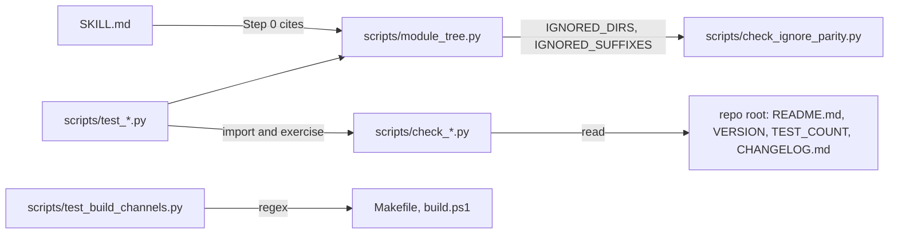

# src

Path: `src`
Purpose: Source of the Repo Remap skill: the protocol `SKILL.md` and the `scripts/` directory (shipped mapper plus dev-only gates and tests).

## Scope

Repo Remap is a Claude Code skill that regenerates a repository's documentation bottom-up as self-contained `README.md` (people) and `CLAUDE.md` (Claude) files, one pair per qualifying module.

- Here: `SKILL.md` (protocol) and `scripts/` (Python).
- Not here: build channels (`Makefile`, `build.ps1`), `VERSION`, `TEST_COUNT`, `CHANGELOG.md`, `LICENSE` and the user README, all at repo root.

## Architecture



Build (`make build`) copies `src/SKILL.md` to `build/repo-remap/SKILL.md`, substitutes placeholders, and copies only `src/scripts/module_tree.py` to `build/repo-remap/scripts/`.

## Key files

| File | Role | Notes |
| --- | --- | --- |
| `SKILL.md` | The protocol Claude follows | Shipped. Frontmatter placeholders substituted at build |
| `scripts/module_tree.py` | Module mapper CLI | Shipped. Stdlib only, read-only |
| `scripts/check_readme_parity.py` | Gate: README badges vs `VERSION`, `TEST_COUNT` | Dev-only, `validate` |
| `scripts/check_changelog_parity.py` | Gate: top CHANGELOG entry vs `VERSION` | Dev-only, `validate` |
| `scripts/check_ignore_parity.py` | Gate: README ignore paragraph vs mapper lists | Dev-only, `validate` |
| `scripts/check_test_count.py` | Gate: `TEST_COUNT` vs live suite | Dev-only, `test` only |
| `scripts/test_*.py` | 6 unittest suites, 75 tests | Dev-only |

## Public interface

### SKILL.md frontmatter

```yaml
name: repo-remap
description: <trigger text>
version: __SKILL_VERSION__
released: __SKILL_DATE__
commit: __SKILL_COMMIT__
```

`validate` requires `^name:`, `^description:` and all three placeholder tokens.

### SKILL.md sections

Definitions (module, direct files, leaf, qualifying, skipped), Workflow (Step 0 map, Pass 1 leaves, Pass 2 one level up, Pass 3 repeat to root), Self-containment, README.md format, CLAUDE.md format (target 200 lines, ceiling 300), Style constraints, Reporting back (file list grouped by pass), Checklist.

Step 0 cites `python3 <skill-path>/scripts/module_tree.py <repo-root>`. `validate` fails if any `scripts/<x>.py` cited in `SKILL.md` does not exist under `src/scripts/`.

### scripts/module_tree.py

`python3 module_tree.py <root> [--min-files N] [--ignore DIR ...]`. Prints qualifying modules grouped by depth, deepest first, with `files=<n>`, `leaf` or `parent of <k>`, and `[README]`/`[CLAUDE]`/`[README+CLAUDE]` markers, then a SKIPPED block. Exit 1 if root is not a directory.

### Gates

Each `check_*.py`: `main(argv=None) -> int`, optional root argument, default repo root (`parents[2]` of the script). Prints `PASS ...` or `FAIL [<tag>] ...`. Exit 0 or 1. Importable without side effects.

## Data shapes

- Qualifying rule: direct file count `> min_files` (default 2), or any qualifying child. Root always qualifies. Dirs with no counted files anywhere in their subtree are dropped.
- Not counted as source files: `README.md`, `CLAUDE.md`, `.DS_Store`, `.gitkeep`, any dotfile, suffixes `.pyc .pyo .class .o .so .dll .dylib .log .lock .map .min.js .min.css .snap`.
- Ignored dirs: the `IGNORED_DIRS` set in `scripts/module_tree.py`, plus every dotted dir except `.github`.

## Invariants and constraints

- Never write a literal version into `SKILL.md`; keep the three `__SKILL_*__` placeholders.
- Only `SKILL.md` and `scripts/module_tree.py` from this tree ship. `check_*.py` and `test_*.py` never ship or sync.
- The qualifying rule in `SKILL.md` Definitions must match `module_tree.qualifying` (strictly greater than N, or a qualifying descendant, root always).
- `SKILL.md` Definitions lists only a subset of `IGNORED_DIRS` and names "lockfile-only dirs", which `module_tree.py` does not implement. No gate checks this list.
- `SKILL.md` style constraints apply to all generated docs: no emojis, no em dashes, no preambles or closing summaries, Mermaid allowed, never invent behavior.
- `module_tree.py`: stdlib only, Python 3.8+, never writes files.
- `TEST_COUNT` at repo root must equal the live suite count (75).

## Dependencies

- Python 3.8+ standard library only.
- Gates read repo-root files: `README.md`, `VERSION`, `TEST_COUNT`, `CHANGELOG.md`; `test_build_channels.py` reads `Makefile` and `build.ps1`.

## Failure modes

- Missing placeholder or frontmatter key in `SKILL.md`: `make validate` prints `ERROR: ...` and exits 1.
- `SKILL.md` cites a script that does not exist: `ERROR: src/SKILL.md cites scripts/<x>.py but src/scripts/<x>.py not found`.
- Gate drift (badges, changelog, ignore paragraph, test count): `FAIL [<tag>]` from the gate, and the three live-repo unittest cases fail too.

## Working here

- Editing `SKILL.md`: keep frontmatter keys and placeholders; if you cite a new `scripts/<x>.py`, it must exist under `src/scripts/`. If the Definitions or workflow change, check the repo README's matching sections and mermaid diagram.
- Editing `scripts/module_tree.py` ignore lists: update the README "Ignored by default" paragraph (gated) and the `SKILL.md` Definitions list (not gated).
- Adding a script: add it to the lint lists in both `Makefile` and `build.ps1`; `test_build_channels.py` compares them with the live `src/scripts/*.py` set.
- Adding tests: rerun the suite, update `TEST_COUNT` and the README tests badge.
- Run from repo root: `make validate`, `make test`, `make build` then `grep -c __SKILL_ build/repo-remap/SKILL.md` must print 0.
- Commit tags: `[skill]` for `SKILL.md`, `[script]` for `scripts/`.
