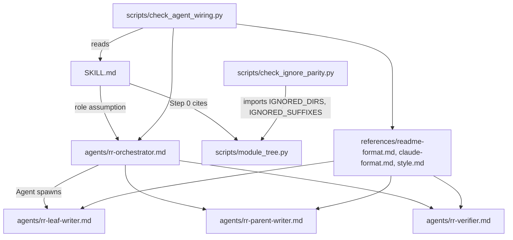

# src

Path: `src`
Purpose: Source of the Repo Remap skill: protocol `SKILL.md`, subagent definitions `agents/`, format rules `references/`, and Python `scripts/` (shipped mapper plus dev-only gates and tests).

## Scope

Repo Remap is a Claude Code skill that regenerates a repository's docs bottom-up as a self-contained `README.md` (people) and `CLAUDE.md` (Claude) per qualifying module.

- Here: `SKILL.md` (the only direct file), `agents/` (4 `rr-*.md`), `references/` (3 rule files), `scripts/` (1 shipped script, 5 gates, 7 test suites).
- Not here: build channels (`Makefile`, `build.ps1`), `VERSION`, `TEST_COUNT`, `CHANGELOG.md`, `LICENSE`, the user `README.md`, all at repo root.

Terms:

- Module: dir with more than `MIN FILES` (default 2) direct counted files, or a qualifying descendant. Repo root always qualifies. Dirs with no counted files anywhere below are dropped.
- Leaf: module with no qualifying descendants. Parent: any other module.
- `<skill-path>`: the dir holding the installed `SKILL.md`, for example `~/.claude/skills/repo-remap`.

## Architecture



Runtime flow of a remap:

1. `SKILL.md` "Orchestrator role assumption": the main thread reads `<skill-path>/agents/rr-orchestrator.md` and becomes the orchestrator. It must not spawn another orchestrator.
2. Step 0: `python3 <skill-path>/scripts/module_tree.py <repo-root>`. Script missing or failing: map by hand. More than roughly 25 qualifying modules: confirm scope with the user.
3. Pass 1: `rr-leaf-writer` per leaf, deepest first, same depth in parallel in one message.
4. Pass 2 and 3: `rr-parent-writer` per parent once every qualifying child is `verified` or `open`; root last.
5. After each writer reply, `rr-verifier` for that module. `FAIL`: re-dispatch the same writer with a `FIX:` block, max 2 retries, then mark `open`. A rewritten child resets every ancestor to `pending`.

Module status: `pending`, `written`, `verified`, `open`.

## Key files

| File | Role | Notes |
| --- | --- | --- |
| `SKILL.md` | Protocol Claude follows | Shipped. Sections: Orchestrator role assumption, Definitions, Workflow (Step 0, Pass 1 to 3), Sub-agent architecture, Dispatch rules (a) to (f), Reporting back, Checklist, References |
| `agents/rr-orchestrator.md` | Step 0, scheduling, retries, final report | `tools: Agent(rr-leaf-writer, rr-parent-writer, rr-verifier), ...`; `skills: [repo-remap]`. Never reads source or doc bodies |
| `agents/rr-leaf-writer.md` | Both docs for one leaf, from source | `disallowedTools: Agent`, `model: inherit` |
| `agents/rr-parent-writer.md` | Both docs for one parent or root, from child docs | `disallowedTools: Agent`, `model: inherit`. Reads SKIPPED DIRS files directly; never edits child docs |
| `agents/rr-verifier.md` | Read-only check of one module | `disallowedTools: Agent, Write, Edit`, `model: sonnet` |
| `references/readme-format.md` | `README.md` template | Intro, What it is for, How it works, Files, How to use it, Things to know |
| `references/claude-format.md` | `CLAUDE.md` template | `Path:`, `Purpose:`, Scope ... Working here. Target 200 lines, ceiling 300 |
| `references/style.md` | Self-containment and style rules | No cross-doc pointers, no emojis, no em dashes, no preamble or closing summary, never invent behavior |
| `scripts/module_tree.py` | Module mapper CLI | Shipped. Stdlib only, read-only |
| `scripts/check_*.py` | 5 gates | Dev-only. `check_test_count.py` runs under `test`; the other 4 under `validate` |
| `scripts/test_*.py` | 7 unittest suites, 102 tests (`test_build_channels.py` 27) | Dev-only. Total must equal repo-root `TEST_COUNT` |

## Public interface

### SKILL.md frontmatter

```yaml
name: repo-remap
description: <trigger text>
version: __SKILL_VERSION__
released: __SKILL_DATE__
commit: __SKILL_COMMIT__
```

Build substitutes `__SKILL_VERSION__` (from `VERSION`), `__SKILL_DATE__` (UTC `YYYY-MM-DD`), `__SKILL_COMMIT__` (`git rev-parse --short HEAD`).

### Spawn prompt contract (orchestrator to workers)

```
SKILL PATH: <abs>
REPO ROOT: <abs>
MODULE: <repo-relative path, "." for root>
CHILD DOCS: <paths or none>      (parent writer, and verifier for a parent)
SKIPPED DIRS: <paths or none>    (parent writer only)
MIN FILES: <N>
FIX: <verifier defect lines>     (optional, writer retries only)
```

Never paste file contents or earlier worker output into a prompt. Workers fall back to `~/.claude/skills/repo-remap` when `SKILL PATH` is absent.

### Replies

- Writers, at most 5 lines: `Wrote: <MODULE>/README.md, <MODULE>/CLAUDE.md`, `Purpose: <one line>`, `Open: <questions, child doc errors, or none>`.
- Verifier: `PASS`, or `FAIL` plus one `<repo-relative doc path>: <defect>` line per defect, max 15.

### Fallbacks

- `rr-*` subagent types unavailable: spawn `general-purpose` with the same prompt prefixed by `Read <skill-path>/agents/rr-<name>.md and follow it.`
- No subagents: run the passes in the main thread, reading the three `references/*.md` directly.

### scripts/module_tree.py

`python3 module_tree.py <root> [--min-files N] [--ignore DIR ...]`. Prints qualifying modules grouped by depth, deepest first, root last, each with `files=<n>`, `leaf` or `parent of <k>`, and `[README]`/`[CLAUDE]`/`[README+CLAUDE]` markers, then a SKIPPED block when non-empty. Exit 1 with `not a directory: <abs>` on stderr if root is not a dir, 0 otherwise. Never writes files.

### Gates

Each `scripts/check_*.py`: `main(argv=None) -> int`, `run(root: Path) -> int`, optional root argument defaulting to the repo root (`Path(__file__).resolve().parents[2]`). Prints `PASS ...` or `FAIL [<tag>] ...`, exits 0 or 1. Importable without side effects.

| Gate | Checks |
| --- | --- |
| `check_readme_parity.py` | README version badge vs `VERSION`, tests badge vs `TEST_COUNT` |
| `check_changelog_parity.py` | First `## [X.Y.Z] - YYYY-MM-DD` in `CHANGELOG.md` vs `VERSION` |
| `check_ignore_parity.py` | README "Ignored by default" paragraph vs `IGNORED_DIRS`, `IGNORED_SUFFIXES` |
| `check_agent_wiring.py` | Agent frontmatter, workers barred from `Agent`, orchestrator `Agent(...)` list, dangling agent and reference citations, verifier model `sonnet` |
| `check_test_count.py` | Live suite pass count vs `TEST_COUNT` |

## Data shapes

- Not counted as source files: `README.md`, `CLAUDE.md`, `.DS_Store`, `.gitkeep`, any dotfile, suffixes `.pyc .pyo .class .o .so .dll .dylib .log .lock .map .min.js .min.css .snap`.
- Ignored dirs: `IGNORED_DIRS` in `scripts/module_tree.py`, plus every dotted dir except `.github`.
- Agent frontmatter: `---` block with `name` (equals file stem), `description`, `tools`, optional `disallowedTools`, `model`, `color`; orchestrator also has `skills:`.
- Citation patterns: `scripts/[a-z0-9_]+\.py`, `references/[a-z0-9_-]+\.md`, `agents/rr-[a-z-]+\.md` (Makefile `validate`); `check_agent_wiring.py` also matches `subagent_type: "rr-<x>"`.

## Invariants and constraints

- Never write a literal version into `SKILL.md`; keep `name:`, `description:` and the three `__SKILL_*__` placeholders. After `make build`, `grep -c __SKILL_ build/repo-remap/SKILL.md` is 0.
- Every `scripts/<x>.py`, `references/<x>.md` and `agents/rr-<x>.md` cited in `SKILL.md` must exist under `src/` (`make validate`). Every agent or reference cited in any `agents/*.md`, including this tree's `README.md` and `CLAUDE.md` there, must exist (`check_agent_wiring.py`).
- `SKILL.md` Definitions must match `module_tree.qualifying`: count strictly greater than N, or a qualifying descendant, root always.
- `SKILL.md` Definitions lists only a subset of `IGNORED_DIRS` and names "lockfile-only dirs", which `module_tree.py` does not implement. No gate checks that list.
- Shipped from this tree: `SKILL.md`, `scripts/module_tree.py` (`SCRIPT_FILES`), `agents/rr-*.md` (`AGENT_FILES`), `references/*.md` minus `README.md` and `CLAUDE.md` (`REFERENCE_FILES`). `check_*.py`, `test_*.py` and every `README.md`/`CLAUDE.md` here never ship or sync.
- Install layout (`make sync-skill`, `.\build.ps1 sync-skill`): `SKILL.md`, `scripts/module_tree.py`, `references/` and `agents/rr-*.md` go under `~/.claude/skills/repo-remap/`, so `<skill-path>/agents/rr-orchestrator.md` resolves. `rr-*.md` is also copied to `~/.claude/agents/` (shared dir, only `rr-*.md` pruned), which registers the `rr-*` subagent types. Every copy is diffed against source. `make package` zip and tarball carry `agents/` inside the skill dir only.
- Only files matching `agents/rr-*.md` are agents; any other `.md` in `agents/` is ignored by build, validate frontmatter loop and sync.
- Every non-orchestrator agent has `Agent` in `disallowedTools`; the orchestrator's `Agent(...)` list names exactly the other `rr-*.md` files; `rr-verifier` has `model: sonnet`.
- Writers create or edit only `MODULE/README.md` and `MODULE/CLAUDE.md`. The references override agent files on format.
- `module_tree.py`: Python 3.8+, stdlib only, never writes files.
- Changing `IGNORED_DIRS` or `IGNORED_SUFFIXES` requires updating the repo README "Ignored by default" paragraph (gated) and `SKILL.md` Definitions (not gated).

## Dependencies

- Python 3.8+ standard library only.
- Claude Code subagent support (`Agent` tool, `subagent_type`) for the multi-agent path; the in-thread fallback needs none.
- Gates read repo-root `README.md`, `VERSION`, `TEST_COUNT`, `CHANGELOG.md`; `test_build_channels.py` reads `Makefile` and `build.ps1`.

## Failure modes

- `make validate` prints `ERROR: <reason>` and exits 1 for: missing `SKILL.md`, `name:`/`description:` or a placeholder; missing `src/scripts/`, `src/agents/` or `src/references/`; a cited script, reference or agent not found (`ERROR: src/SKILL.md cites <x> but src/<x> not found`); no `rr-*.md` (`ERROR: src/agents/ has no agent definitions`); an `rr-*.md` missing `name:`, `description:` or `tools:`.
- Gate drift: `FAIL [<tag>]` from the gate; live-repo unittest cases in four suites (readme, changelog, ignore, agent wiring) fail too.
- A module failing verification after 2 retries is marked `open` and listed in the orchestrator's final report.
- `make sync-skill` prints `ERROR: sync diff mismatch` if an installed agent or reference differs from its source, and `ERROR: sync diff mismatch: unexpected agents/<name>` or `unexpected references/<name>` for a file in the skill install that is not shipped.

## Working here

- Editing `SKILL.md`: keep frontmatter keys and placeholders. Any cited `scripts/`, `agents/` or `references/` path must exist. If Definitions or workflow change, update the repo README's matching sections and the agent files that restate them.
- Changing the spawn contract or reply format: edit `SKILL.md` Dispatch rules, `agents/rr-orchestrator.md` and every affected worker together.
- Adding an agent: `agents/rr-<x>.md`, `name: rr-<x>`, keys `name`, `description`, `tools`, `model`, `disallowedTools: Agent` unless orchestrator, and add it to the orchestrator's `Agent(...)` list.
- Adding a reference: lowercase `[a-z0-9_-]` name, never `README.md` or `CLAUDE.md`; it ships automatically.
- Adding a script: add it to the lint lists in `Makefile` (`lint`) and `build.ps1` (`$LintFiles`). Do not add it to `SCRIPT_FILES`/`$ScriptFiles` unless it must ship.
- Adding or removing tests: rerun `python3 -m unittest discover -s src/scripts -p "test_*.py"`, update repo-root `TEST_COUNT`, the README tests badge and per-suite counts.
- Keep `Makefile` and `build.ps1` in lockstep; `scripts/test_build_channels.py` fails on drift.
- Run from repo root: `make validate`, `make test`, `make build`, `python3 src/scripts/check_agent_wiring.py`.
- Commit tags: `[skill]` for `SKILL.md`, `[script]` for `scripts/`.
