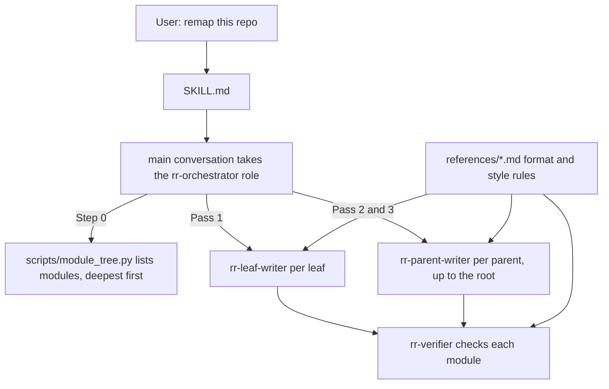

# src

This folder (`src/` in the repo-remap repository) holds everything that makes up the Repo Remap skill: the protocol file `SKILL.md`, the agent definitions, the doc format rules, and the Python scripts.

## What it is for

Repo Remap is a Claude Code skill. When a user says something like "remap this repo" or "the docs are out of date", Claude follows it to rewrite the repository's documentation as a tree of `README.md` files (for people) and `CLAUDE.md` files (for Claude), one pair per directory worth documenting. It writes the deepest directories first and writes each parent from its children's finished docs, so nothing is guessed from a folder name. The files at the repo root (build scripts, `VERSION`, `CHANGELOG.md`) turn this folder into an installable package.

## How it works

A "module" is a directory with more than 2 direct source files (more than N with `--min-files N`), or with a qualifying directory somewhere below it. The repo root always qualifies. A "leaf" is a module with no qualifying module below it; every other module is a "parent".



1. `SKILL.md` tells the main conversation to read `agents/rr-orchestrator.md` and act as the orchestrator.
2. The orchestrator runs `scripts/module_tree.py` to get the list of modules in processing order.
3. It sends each leaf to a leaf writer, then each module to the verifier. On a failed check the writer gets up to 2 retries with the defect list.
4. Parents go out once their children are done, one level at a time, ending at the repo root.
5. Writers and the verifier all read the same three rule files in `references/`.

## Files

- `SKILL.md` - the protocol Claude reads: definitions, the passes, agent roles, dispatch rules (spawn prompt contract, replies, parallelism, retries, fallbacks), reporting and a checklist. Its frontmatter holds build placeholders.
- `agents/` - four Claude Code subagent definitions: `rr-orchestrator.md` (plans and tracks the run, never reads code), `rr-leaf-writer.md` (docs for one leaf from its source), `rr-parent-writer.md` (docs for one parent from its children's docs), `rr-verifier.md` (read-only checker, runs on the `sonnet` model).
- `references/` - three rule files every writer and the verifier read: `readme-format.md`, `claude-format.md` (target about 200 lines, ceiling 300), `style.md` (self-containment and style rules).
- `scripts/` - Python, standard library only. `module_tree.py` is the mapper that ships. The `check_*.py` gates and `test_*.py` suites (102 tests) keep the repo consistent and never ship.

## How to use it

Install the skill and agents from the repo root, then ask Claude Code to "remap this repo" in any project:

```bash
make sync-skill
```

Run the mapper directly on any repo:

```bash
python3 src/scripts/module_tree.py /path/to/some/repo
python3 src/scripts/module_tree.py . --min-files 3
```

Check the source from the repo root:

```bash
make validate
make test
```

## Things to know

- `SKILL.md` has three placeholders in its frontmatter (`__SKILL_VERSION__`, `__SKILL_DATE__`, `__SKILL_COMMIT__`). The build replaces them. The source copy never holds a real version number.
- What ships: `SKILL.md`, `scripts/module_tree.py`, `agents/rr-*.md` and the three rule files in `references/`. The `README.md` and `CLAUDE.md` files in this tree are docs for this repo and never ship.
- `make sync-skill` puts `SKILL.md`, the mapper and the rule files in `~/.claude/skills/repo-remap/`, and copies the agent files to two places: `~/.claude/skills/repo-remap/agents/`, where `SKILL.md` reads them, and `~/.claude/agents/`, which makes Claude Code offer them as subagent types. It then checks every copy against the source. The zip and tarball from `make package` hold the agent files only in an `agents/` folder inside the skill.
- The ignored directory list in `SKILL.md` is a short sample. The full list is in `scripts/module_tree.py`. `SKILL.md` also mentions "lockfile-only dirs", which the script does not detect.
- `make validate` fails if `SKILL.md` cites a `scripts/`, `agents/` or `references/` file that does not exist, or if an agent file cites a missing agent or reference file.
- Python 3.8 or newer, standard library only. Nothing to install.
