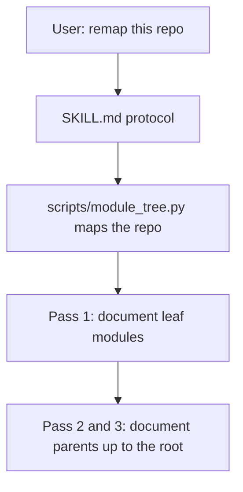

# src

Everything that makes up the Repo Remap skill itself, in `src/` of the repo-remap repository: the protocol text and the Python scripts.

## What it is for

Repo Remap is a Claude Code skill. When a user says something like "remap this repo", Claude follows it to rewrite the repository's documentation as a tree of `README.md` files (for people) and `CLAUDE.md` files (for Claude), one pair per directory that is worth documenting. It writes the deepest directories first and each parent from its children's finished docs, so nothing is guessed from a folder name.

This directory holds the source of that skill. The files around it at the repo root (build scripts, version file, changelog) turn it into a package.

## How it works

`SKILL.md` is the set of instructions Claude reads. It defines what a module is, lays out the passes from leaves to root, and fixes the format and style of both doc files. At its first step it tells Claude to run `scripts/module_tree.py`, which prints the directories that need docs, deepest first.



## Files

- `SKILL.md` - the protocol: frontmatter, definitions, workflow passes, self-containment rule, README and CLAUDE formats, style constraints, reporting, checklist.
- `scripts/` - the Python code. `module_tree.py` is the mapper that ships with the skill. The `check_*.py` scripts are gates that keep the README, changelog, version and ignore lists in agreement, and the `test_*.py` files are their unittest suites. Only `module_tree.py` ships.

## How to use it

Install the built skill and say "remap this repo" in any project. To run the mapper directly from this repo:

```bash
python3 src/scripts/module_tree.py /path/to/some/repo
```

## Things to know

- `SKILL.md` contains three placeholders in its frontmatter (`__SKILL_VERSION__`, `__SKILL_DATE__`, `__SKILL_COMMIT__`). The build replaces them. The source copy never holds a real version number.
- A directory qualifies for docs when it has more than 2 direct source files, or has a qualifying directory below it. The repo root always qualifies.
- The list of ignored directories in `SKILL.md` is a short sample. The full list lives in `scripts/module_tree.py`. `SKILL.md` also mentions "lockfile-only dirs", which the script does not detect.
- Python 3.8 or newer, standard library only.
