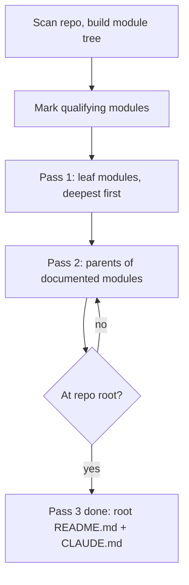

# Repo Remap

Regenerate the documentation layer of a repository as a bottom-up tree of self-contained files. Each documented directory gets exactly two files:

- `README.md` for people. Plain, simple, readable.
- `CLAUDE.md` for Claude. Dense, operational, actionable.

Bottom-up matters: a parent's docs are written from its children's finished docs plus its own files, so information is summarized upward instead of being guessed downward.

## Definitions

- **Module**: any directory containing source files, excluding ignored directories (`.git`, `node_modules`, `venv`, `.venv`, `dist`, `build`, `target`, `__pycache__`, `.next`, `vendor`, `coverage`, lockfile-only dirs).
- **Direct files**: source files directly inside the directory, not counting `README.md` and `CLAUDE.md`.
- **Leaf module**: a module with no child modules.
- **Qualifying module**: a module with more than 2 direct files, or a module with at least one qualifying descendant. Only qualifying modules get docs.
- **Skipped module**: 2 or fewer direct files and no qualifying descendant. Do not write docs there. Its contents are documented by the nearest qualifying ancestor.

The repo root always gets docs, regardless of file count.

## Workflow



### Step 0: Map the repo

Run the helper to get modules ordered deepest-first with file counts:

```bash
python3 scripts/module_tree.py <repo-root>
```

It prints qualifying modules in processing order, plus skipped ones. If the script is unavailable, do the same by hand: list directories, count direct files, discard ignored paths, sort by path depth descending.

Confirm the module list with the user before writing if the repo is large (more than roughly 25 qualifying modules), so they can exclude areas they do not want touched.

### Pass 1: leaf modules

For each qualifying leaf module, deepest first:

1. Read every direct source file in the module. Do not skim. Public API, entry points, side effects, and error paths matter.
2. Read the existing `README.md` and `CLAUDE.md` if present. Treat them as claims to verify against the code, not as truth. Keep what is still accurate, drop what is stale, do not preserve their structure.
3. Write a new `README.md` and a new `CLAUDE.md`, both self-contained.
4. Overwrite the old files completely.

### Pass 2: one level up

For each qualifying module whose children are all documented:

1. Read the module's own direct source files.
2. Read the `README.md` and `CLAUDE.md` of each documented child.
3. Read the child directories that were skipped, since no one else documents them.
4. Write the parent's `README.md` and `CLAUDE.md`, summarizing children rather than copying them. A parent states what each child is for and how the pieces connect; it does not restate child-level internals.

### Pass 3: repeat to the root

Apply Pass 2 iteratively, one level at a time, until the repo root has been written. The root docs describe the whole system: what it is, how to run it, how the top-level pieces fit together, and where the important behavior lives.

Never document a parent before its children. If a child is rewritten later, rewrite every ancestor above it.

## Self-containment

A reader must be able to act on one file alone, without opening another file in the tree.

Rules:

- No cross-document links or pointers such as "see the parent README", "as described in `../core/CLAUDE.md`", "refer to the root docs".
- Repeat the context a reader needs, even if it also appears elsewhere. Duplication across files is expected and correct here.
- Referring to source files by path is fine and encouraged. Referring to other docs is not.
- Define local terms, acronyms, and domain words in the file that uses them.
- Each file states what the module is and where it sits in the repo in its first lines, so it works when read in isolation.

## README.md format

For a person who has never seen this code. Simple words, short sentences, concrete. No jargon without a one-line explanation. Assume competence, not context.

```markdown
# <module name>

<One or two sentences: what this is and what it does.>

## What it is for

<Plain explanation of the problem it solves. 3 to 6 sentences.>

## How it works

<Plain walkthrough of the main flow. Mermaid diagram if it makes the flow clearer.>

## Files

- `name.ext` - what it does, in one line.

## How to use it

<Minimal, runnable example or the command to run. Real values, not placeholders where avoidable.>

## Things to know

<Gotchas, limits, assumptions, required environment. Short bullets.>
```

Adapt headings to the module. Drop sections that would be empty. Length follows the module: a small module gets a short README.

## CLAUDE.md format

For Claude working in this module. Operational, specific, no motivation or sales copy. Target around 200 lines, hard ceiling 300 lines. If it will not fit, cut narrative and keep contracts, invariants, and paths.

```markdown
# <module name>

Path: `<path from repo root>`
Purpose: <one line>

## Scope

<What lives here and what explicitly does not.>

## Architecture

<Structure, data flow, control flow. Mermaid for state machines, protocols, pipelines.>

## Key files

| File | Role | Notes |
| --- | --- | --- |

## Public interface

<Exported functions, classes, endpoints, CLI commands, events. Signatures with types. Inputs, outputs, raised errors.>

## Data shapes

<Important structs, schemas, payloads, DB tables, config keys.>

## Invariants and constraints

<What must stay true. Ordering requirements, thread or async rules, idempotency, resource lifecycles.>

## Dependencies

<Internal modules relied on and what is used from them. External packages and why.>

## Failure modes

<Known errors, how they surface, how they are handled.>

## Working here

<Concrete rules for changing this code: conventions, where to add new cases, what to update in tandem, how to test, commands to run.>
```

Include the `Path:` line and enough context that the file is useful when read alone.

## Style constraints

These apply to every generated file:

- Plain, direct language.
- No emojis.
- No em dashes.
- No preamble, no closing summary, no meta-commentary about the documentation itself.
- Mermaid is allowed and encouraged for diagrams, flows, state machines, and protocols.
- Do not invent behavior. If something is unclear from the code, say it is unclear or leave it out. Never guess at intent and present it as fact.
- Override any of this only when the user explicitly asks.

## Reporting back

When the whole run is complete, report only a file list: paths written, grouped by pass. No narrative.

## Checklist

Before finishing, verify:

- Every qualifying module has both files, and no skipped module has them.
- No file references another doc file.
- Every `CLAUDE.md` is under 300 lines.
- Parents summarize children rather than duplicating their internals.
- Skipped directories are covered by their nearest documented ancestor.
- No emojis, no em dashes, no preambles anywhere.
