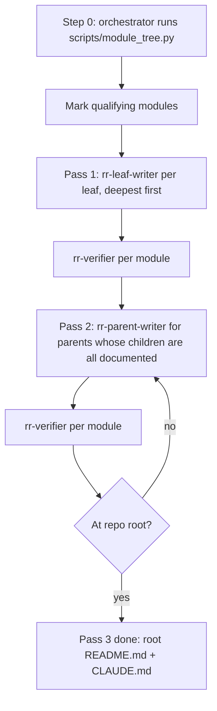

# Repo Remap

Regenerate the documentation layer of a repository as a bottom-up tree of self-contained files. Each documented directory gets exactly two files:

- `README.md` for people. Plain, simple, readable.
- `CLAUDE.md` for Claude. Dense, operational, actionable.

Bottom-up matters: a parent's docs are written from its children's finished docs plus its own files, so information is summarized upward instead of being guessed downward. The main thread orchestrates; subagents read code and write docs.

`<skill-path>` is the directory holding this SKILL.md (for example `~/.claude/skills/repo-remap`).

## Orchestrator role assumption (read first)

Read `<skill-path>/agents/rr-orchestrator.md` and assume that role in this thread. Do not spawn an orchestrator agent: you are the orchestrator.

If the agents are not installed (no `agents/rr-*.md` files and no `rr-*` subagent types), follow this file directly, as described under Dispatch rules, item (f).

## Definitions

- **Module**: any directory containing source files, excluding ignored directories (`.git`, `node_modules`, `venv`, `.venv`, `dist`, `build`, `target`, `__pycache__`, `.next`, `vendor`, `coverage`, lockfile-only dirs).
- **Direct files**: source files directly inside the directory, not counting `README.md` and `CLAUDE.md`.
- **Leaf module**: a module with no child modules.
- **Qualifying module**: a module with more than 2 direct files (more than N when `--min-files N` is given), or a module with at least one qualifying descendant. Only qualifying modules get docs.
- **Skipped module**: 2 or fewer direct files (N or fewer) and no qualifying descendant. Do not write docs there. Its contents are documented by the nearest qualifying ancestor.

The repo root always gets docs, regardless of file count.

## Workflow



### Step 0: Map the repo

Done by the orchestrator. Run the helper to get modules ordered deepest first with file counts:

```bash
python3 <skill-path>/scripts/module_tree.py <repo-root>
```

It prints qualifying modules in processing order, plus skipped ones. If the script is unavailable, do the same by hand: list directories, count direct files, discard ignored paths, sort by path depth descending.

Confirm the module list with the user before writing if the repo is large (more than roughly 25 qualifying modules), so they can exclude areas they do not want touched.

### Pass 1: leaf modules

Done by `rr-leaf-writer`, one spawn per qualifying leaf module, deepest first. Each module is then checked by `rr-verifier`.

For each module the writer:

1. Reads every direct source file in the module. Does not skim. Public API, entry points, side effects, and error paths matter.
2. Reads the existing `README.md` and `CLAUDE.md` if present. Treats them as claims to verify against the code, not as truth. Keeps what is still accurate, drops what is stale, does not preserve their structure.
3. Writes a new `README.md` and a new `CLAUDE.md`, both self-contained.
4. Overwrites the old files completely.

### Pass 2: one level up

Done by `rr-parent-writer`, one spawn per qualifying module whose children are all documented. Each module is then checked by `rr-verifier`.

For each module the writer:

1. Reads the module's own direct source files.
2. Reads the `README.md` and `CLAUDE.md` of each documented child.
3. Reads the child directories that were skipped, since no one else documents them.
4. Writes the parent's `README.md` and `CLAUDE.md`, summarizing children rather than copying them. A parent states what each child is for and how the pieces connect; it does not restate child-level internals.

### Pass 3: repeat to the root

Done by `rr-parent-writer` and checked by `rr-verifier`, as in Pass 2. Apply Pass 2 iteratively, one level at a time, until the repo root has been written. The root docs describe the whole system: what it is, how to run it, how the top-level pieces fit together, and where the important behavior lives.

Never document a parent before its children. If a child is rewritten later, every ancestor above it is invalidated and must be rewritten.

## Sub-agent architecture

| Agent | Handles | Model | Reads | Writes |
| --- | --- | --- | --- | --- |
| `rr-orchestrator` | Step 0, scheduling, dispatch, retries, final report | inherit | Mapper output and short worker replies only, never source or doc bodies | Nothing, except in the fallback |
| `rr-leaf-writer` | Pass 1, one leaf module per spawn | inherit | The module's direct files, its old docs, `references/readme-format.md`, `references/claude-format.md`, `references/style.md` | `MODULE/README.md`, `MODULE/CLAUDE.md` |
| `rr-parent-writer` | Pass 2 and 3, one parent module per spawn | inherit | Its own direct files, its children's `README.md` and `CLAUDE.md`, skipped child dirs, the same three references | The parent's `README.md` and `CLAUDE.md` |
| `rr-verifier` | Check one module after its writer | sonnet | The module's two docs, its direct files, `references/style.md`, `references/readme-format.md`, `references/claude-format.md` | Nothing (read-only) |

## Dispatch rules

(a) Spawn prompt contract. Every spawn prompt carries exactly these lines and nothing else of substance:

```text
SKILL PATH: <absolute path>
REPO ROOT: <absolute path>
MODULE: <repo-relative path>
CHILD DOCS: <paths or none>      (rr-parent-writer, and rr-verifier for a parent)
SKIPPED DIRS: <paths or none>    (rr-parent-writer only)
MIN FILES: <N>
```

Never paste file contents or earlier worker output into a prompt.

(b) Replies. Writers reply in at most 5 lines: files written, a one-line purpose, open questions. Never the doc bodies. The verifier replies `PASS`, or `FAIL` plus one line per defect in the form `<file>: <defect>`.

(c) Parallelism. Modules at the same depth with no pending children are dispatched in parallel, in one message.

(d) No nesting. No worker spawns another worker (workers have `disallowedTools: Agent`).

(e) Verification loop. After each writer finishes, dispatch `rr-verifier` for that module. On `FAIL`, re-dispatch the same writer with the same prompt plus a `FIX:` block holding the verifier's defect lines. At most 2 retries; after that, record the module as open and move on. A rewritten module invalidates all its ancestors.

(f) Fallback. If `subagent_type: rr-*` is unavailable, spawn `general-purpose` with the same prompt, prefixed by `Read <skill-path>/agents/rr-<name>.md and follow it.` If subagents are unavailable entirely, run the passes in the main thread, reading `references/readme-format.md`, `references/claude-format.md` and `references/style.md` directly, and check each module against them before moving up.

## Reporting back

When the whole run is complete, report only:

- Paths written, grouped by pass.
- Verifier result per module: `PASS`, or `PASS after <n> retries`.
- Open items: modules still failing after 2 retries, with their defect lines, and open questions raised by writers.

No narrative.

## Checklist

Before finishing, verify:

- Every qualifying module has both files, and no skipped module has them.
- Every module has a `PASS` from `rr-verifier`, or is listed as open.
- No parent was written before its children, and no ancestor of a rewritten module was left stale.
- No file references another doc file.
- Every `CLAUDE.md` is under 300 lines.
- Parents summarize children rather than duplicating their internals.
- Skipped directories are covered by their nearest documented ancestor.
- No emojis, no em dashes, no preambles anywhere.

## References

- `references/readme-format.md`: template and rules for a module `README.md`.
- `references/claude-format.md`: template and rules for a module `CLAUDE.md`, including the 300-line ceiling.
- `references/style.md`: self-containment rules and style constraints for every generated file.
- `agents/rr-orchestrator.md`: the orchestrator role this thread assumes.
- `agents/rr-leaf-writer.md`: Pass 1 writer for one leaf module.
- `agents/rr-parent-writer.md`: Pass 2 and 3 writer for one parent module.
- `agents/rr-verifier.md`: read-only checker for one module's two docs.
