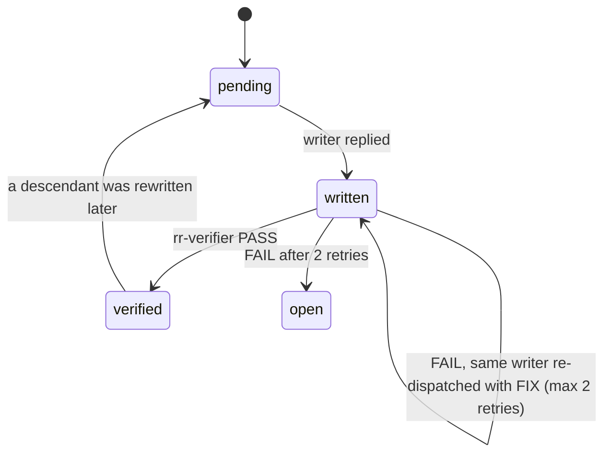

# agents

Path: `src/agents`
Purpose: Claude Code subagent definitions (`rr-*.md`) that run a repo-remap job: one orchestrator, two writers, one verifier.

## Scope

Repo-remap is a Claude Code skill that rebuilds a repo's docs bottom-up as a self-contained `README.md` (people) and `CLAUDE.md` (Claude) per qualifying module. This folder holds the role definitions for that run.

- Here: `rr-orchestrator.md`, `rr-leaf-writer.md`, `rr-parent-writer.md`, `rr-verifier.md`.
- Not here: the protocol (`src/SKILL.md`), the format rules (`src/references/readme-format.md`, `src/references/claude-format.md`, `src/references/style.md`), the mapper (`src/scripts/module_tree.py`), the wiring gate (`src/scripts/check_agent_wiring.py`).

Terms used by every agent:

- Module: a dir with more than `MIN FILES` (default 2) direct counted files, or a qualifying descendant. Repo root always qualifies.
- Leaf: module with no qualifying descendants. Parent: any other module.
- `SKILL PATH`: absolute skill dir. Every worker falls back to `~/.claude/skills/repo-remap` if it is absent.

## Architecture



Orchestrator control flow:

1. Step 0: `python3 <skill-path>/scripts/module_tree.py <repo-root> [--min-files N] [--ignore ...]`. If missing or failing, map by hand with directory listings. More than roughly 25 modules: confirm scope with the user first.
2. Pass 1: all leaves, deepest first; same-depth leaves in parallel in one message.
3. Pass 2 and 3: a parent is dispatched once every qualifying child is `verified` or `open`. Same-depth ready parents in parallel. Root last.
4. After each writer reply, spawn `rr-verifier` for that module.
5. A child rewritten after its parent was written resets every ancestor to `pending`.

Loaded two ways: main thread via `claude --agent rr-orchestrator`, or in-thread when `src/SKILL.md` tells the conversation to read `<skill-path>/agents/rr-orchestrator.md` and assume the role. In the second mode it must not spawn another orchestrator.

## Key files

| File | Role | Notes |
| --- | --- | --- |
| `rr-orchestrator.md` | Step 0, pass loop, state, final report | `tools: Agent(rr-leaf-writer, rr-parent-writer, rr-verifier), Read, Write, Edit, Bash, Glob, Grep`; `skills: [repo-remap]`; `color: blue`. Never reads source or doc bodies |
| `rr-leaf-writer.md` | Writes both docs for one leaf from source | `disallowedTools: Agent`; `color: green`. Reads non-qualifying subdirs under the leaf too |
| `rr-parent-writer.md` | Writes both docs for one parent or root | `disallowedTools: Agent`; `color: cyan`. Reads child docs, not child source; reads SKIPPED DIRS files directly |
| `rr-verifier.md` | Read-only check of one module's two docs | `disallowedTools: Agent, Write, Edit`; `model: sonnet`; `color: purple`. Runs no builds or tests |

All four have `name`, `description`, `tools`, `model` in frontmatter. Writers and orchestrator use `model: inherit`.

## Public interface

### Spawn prompt contract

Workers receive only these lines. Never paste file contents, doc bodies or notes.

```
SKILL PATH: <abs>
REPO ROOT: <abs>
MODULE: <repo-relative path, "." for the root>
CHILD DOCS: <paths or none>       (parent writer, and verifier for a parent)
SKIPPED DIRS: <paths or none>     (parent writer only)
MIN FILES: <N>
FIX: <verifier defect lines>      (optional, writer retries only)
```

Leaf writer and leaf verifier get no `CHILD DOCS` or `SKIPPED DIRS`.

### Replies

Writers, at most 5 lines:

```
Wrote: <MODULE>/README.md, <MODULE>/CLAUDE.md
Purpose: <one line>
Open: <questions, child doc errors found (parent), or none>
```

Verifier: exactly `PASS`, or `FAIL` followed by one `<repo-relative doc path>: <defect>` line per defect, max 15, most serious first.

### Fallbacks

- `rr-*` types unavailable: spawn `general-purpose` with the same contract, prefixed by `Read <skill-path>/agents/rr-<name>.md and follow it.`
- No subagents at all: orchestrator follows each `rr-*.md` in-thread per module, same order.

## Data shapes

- Frontmatter: `---` block with `name` (must equal the file stem), folded `description: >`, `tools`, optional `disallowedTools`, `model`, `color`, and on the orchestrator a `skills:` list.
- Orchestrator state entry: repo-relative path, depth, qualifying children, status (`pending`, `written`, `verified`, `open`).
- Verifier style checks it runs on both docs:
  - `grep -nP '\x{2014}'` (em dash)
  - `grep -nP '[\x{1F300}-\x{1FAFF}\x{2600}-\x{27BF}]'` (emoji)

## Invariants and constraints

Enforced by `src/scripts/check_agent_wiring.py` (run by `make validate`):

- Every `rr-*.md` has a frontmatter block with `name`, `description`, `tools`, `model`; `name` equals the file stem.
- Every non-orchestrator `rr-*.md` has `Agent` in `disallowedTools`.
- `rr-orchestrator.md` `tools` contains `Agent(...)`; every name in it has a file here, and every other `rr-*.md` is listed in it.
- Every `agents/rr-<x>.md` or `subagent_type: rr-<x>` cited in `src/SKILL.md` or any `src/agents/*.md` exists here; every `references/<x>.md` cited exists under `src/references/`.
- `rr-verifier.md` has `model: sonnet`.

Enforced by the build channels (`make validate`, `.\build.ps1 validate`):

- Every `src/agents/rr-*.md` has `name:`, `description:`, `tools:` lines. Other `.md` files here are ignored by this check.

Other rules stated in the files:

- Writers create or edit only `MODULE/README.md` and `MODULE/CLAUDE.md`. Parent writer never edits child docs.
- Writers read the three `references/*.md` first; those override the agent file on format.
- Verifier is read-only and reports defects only, no suggestions.
- Orchestrator never answers writers' open questions by reading code.

## Dependencies

- `src/SKILL.md`: cites `agents/rr-orchestrator.md`, `agents/rr-leaf-writer.md`, `agents/rr-parent-writer.md`, `agents/rr-verifier.md`.
- `src/references/*.md`: format and style rules every worker reads.
- `src/scripts/module_tree.py`: Step 0 mapper; its `IGNORED_DIRS`, `IGNORED_FILES`, `IGNORED_SUFFIXES` are the ignore rules writers apply.
- Claude Code subagent support (`Agent` tool, `subagent_type`).

## Failure modes

- Wiring drift: `check_agent_wiring.py` prints `FAIL [<tag>] ...` with tags `agents-missing`, `agent-frontmatter`, `worker-can-spawn`, `orchestrator-wiring`, `dangling-agent`, `dangling-reference`, `verifier-model`, `agent-wiring-io`; `make validate` fails.
- `make validate` checks only `src/agents/rr-*.md` for `name:`, `description:`, `tools:` lines. A missing key prints `ERROR: src/agents/rr-<x>.md missing '<key>' in frontmatter`. No `rr-*.md` at all prints `ERROR: src/agents/ has no agent definitions`. `README.md` and `CLAUDE.md` here are not checked for frontmatter.
- `make build-combined` with no `rr-*.md` here: `ERROR: no files match src/agents/rr-*.md`.
- A dangling `agents/rr-<x>.md` or `references/<x>.md` citation inside this folder's `README.md` or `CLAUDE.md` still fails `check_agent_wiring.py`: it scans every `src/agents/*.md` for citations.
- `SKILL.md` citing a missing agent file: `ERROR: src/SKILL.md cites agents/rr-<x>.md but src/agents/rr-<x>.md not found`.
- Module fails verification twice after the first try: orchestrator marks it `open` and lists its last defect lines in the final report.

## Working here

- Adding an agent: name it `rr-<x>.md`, set `name: rr-<x>`, include `name`, `description`, `tools`, `model`; add `Agent` to `disallowedTools` unless it is the orchestrator; add it to the orchestrator's `Agent(...)` list. Cite it from `src/SKILL.md` if the protocol uses it.
- Renaming an agent: update the orchestrator `tools` line, every citation in `src/SKILL.md` and other `src/agents/*.md`, then run `make validate`.
- Changing the spawn contract or reply format: edit the orchestrator and every affected worker together; they restate the same lines.
- Packaging: every step uses only `src/agents/rr-*.md` (Makefile `AGENT_FILES`, `build.ps1` `Get-AgentFiles`). `make build` copies them to `build/repo-remap/agents/`. `make build-combined` appends, after `SKILL.md`, the reference files (`src/references/*.md` minus `README.md` and `CLAUDE.md`) then the `rr-*.md` files, each framed as `---` and `<!-- file: agents/<name> -->`. `make sync-skill` installs the `rr-*.md` files in two places. `~/.claude/skills/repo-remap/agents/` is wholly owned: it is pruned of `*.md`, each file is diffed against its source, and any name not in `AGENT_FILES` fails with `ERROR: sync diff mismatch: unexpected agents/<name>`; this is where `SKILL.md`'s `<skill-path>/agents/rr-orchestrator.md` and the `general-purpose` fallback read. `~/.claude/agents/` is shared: only `rr-*.md` is pruned, each copy is diffed, and this is what registers the `rr-*` subagent types. This folder's `README.md` and `CLAUDE.md` are repo docs: they never ship, never sync, never get inlined.
- Keep `Makefile` and `build.ps1` in lockstep. `src/scripts/test_build_channels.py` (class `RepoDocsExcluded`) fails if either channel globs `src/agents/*.md` unfiltered in build, build-combined, validate or sync-skill.
- A new agent file must match `rr-*.md` or no build step picks it up.
- Style for all agent text: plain language, no emojis, no em dashes, no preambles or closing summaries.
- Checks: `make validate`, `python3 src/scripts/check_agent_wiring.py`.
