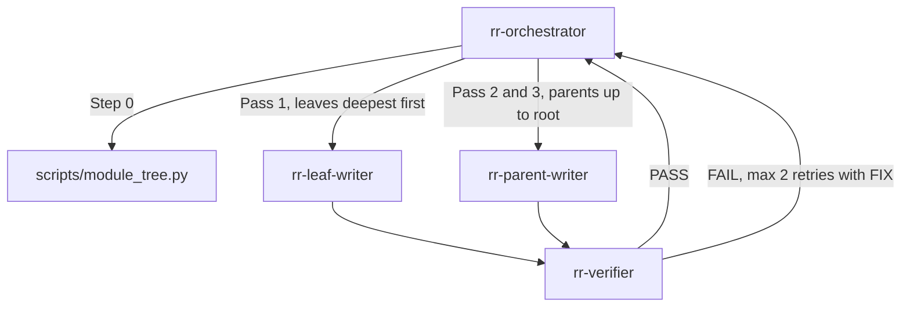

# agents

This folder (`src/agents/` in the repo-remap repository) holds the four Claude Code agent definitions that run a repo-remap job. Repo-remap is a Claude Code skill that rebuilds a repository's docs bottom-up as one `README.md` (for people) and one `CLAUDE.md` (for Claude) per qualifying module.

## What it is for

A remap of a large repo is too much work for one conversation: reading every source file would fill Claude's context before it finished. These files split the job into roles. One orchestrator plans and tracks the run without reading code. Writers read code and write docs for one module each. A verifier checks each module's docs before the run moves up the tree. Each file is plain Markdown with a YAML frontmatter block, the format Claude Code uses for subagent definitions.

## How it works

A "module" is a directory with more than N direct source files (N is `MIN FILES`, default 2), or with a qualifying subdirectory. The repo root always qualifies. A "leaf" is a module with no qualifying descendants; every other module is a "parent".



1. The orchestrator runs the mapper script to list qualifying modules, deepest first.
2. It sends every leaf to a leaf writer. Leaves at the same depth run in parallel.
3. After each writer reply, it sends that module to the verifier.
4. On `FAIL` it sends the same writer back with the defect lines. After 2 failed retries the module is marked `open`.
5. A parent goes out once all its qualifying children have passed (or are `open`). The parent writer reads the children's docs, not their source. The repo root is last.
6. The orchestrator reports files written, verifier results, and open items.

## Files

- `rr-orchestrator.md` - plans the run, dispatches writers and verifiers, tracks module status, writes the final report. Never reads source or doc bodies.
- `rr-leaf-writer.md` - writes `README.md` and `CLAUDE.md` for one leaf module from its source files.
- `rr-parent-writer.md` - writes the two docs for one parent module (or the repo root) from its children's docs, its own files and its non-qualifying subdirectories.
- `rr-verifier.md` - read-only checker for one module's two docs. Replies `PASS` or `FAIL` plus up to 15 defect lines. Runs on the `sonnet` model.

## How to use it

Install the agents and the skill from the repo root:

```bash
make sync-skill
```

This copies `src/agents/rr-*.md` to two places. `~/.claude/skills/repo-remap/agents/` is where `SKILL.md` and the `general-purpose` fallback read `agents/rr-orchestrator.md` and the worker files. `~/.claude/agents/` registers the `rr-*` subagent types with Claude Code. Then ask Claude Code to "remap this repo". The skill's `SKILL.md` tells the main conversation to read `agents/rr-orchestrator.md` and take that role. You can also start the orchestrator as the main thread:

```bash
claude --agent rr-orchestrator
```

Workers receive only short key-value lines, for example:

```
SKILL PATH: /home/me/.claude/skills/repo-remap
REPO ROOT: /home/me/src/myrepo
MODULE: src/agents
MIN FILES: 2
```

## Things to know

- Workers cannot spawn other agents: their frontmatter has `disallowedTools: Agent`. Only the orchestrator's `tools` line has `Agent(rr-leaf-writer, rr-parent-writer, rr-verifier)`.
- Writers may only create or change `MODULE/README.md` and `MODULE/CLAUDE.md`. The parent writer never edits child docs; it reports errors it finds instead.
- If the `rr-*` agent types are not installed, the orchestrator spawns `general-purpose` agents with the same prompt, prefixed by `Read <skill-path>/agents/rr-<name>.md and follow it.` If subagents are unavailable, it does the work in the same conversation.
- Workers read three format files from the skill: `references/readme-format.md`, `references/claude-format.md`, `references/style.md`. Those rules take priority over the agent file on format.
- `make sync-skill` deletes every `*.md` in `~/.claude/skills/repo-remap/agents/` before copying, because the skill owns that folder, then fails if any file there differs from its source or is not an `rr-*.md` from this folder. In `~/.claude/agents/` it deletes and replaces only `rr-*.md`, because that folder is shared with other skills, and compares each copied file with its source.
- Only files named `rr-*.md` count as agents. `make build`, `make build-combined`, `make sync-skill` and the frontmatter check in `make validate` all pick up `rr-*.md` only (the same holds for `build.ps1` on Windows). This README and the `CLAUDE.md` next to it are docs for this repo: they are not packaged, not installed, and not checked for frontmatter.
- `make validate` also runs `src/scripts/check_agent_wiring.py`, which scans every `*.md` here, docs included, for citations like `agents/rr-verifier.md` or `references/style.md`. A citation to a file that does not exist fails validation.
- `src/scripts/check_agent_wiring.py` checks this folder: required frontmatter keys, `name` equal to the file name, workers barred from spawning, the orchestrator's `Agent(...)` list matching the files, every cited agent and reference existing, and the verifier model being `sonnet`.
