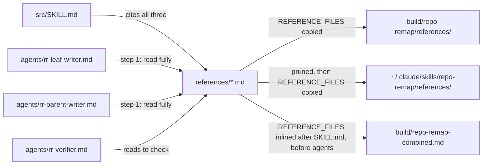

# references

Path: `src/references`
Purpose: Format templates and style rules that the Repo Remap writer and verifier agents read before writing or checking a module `README.md` or `CLAUDE.md`.

## Scope

Repo Remap is a Claude Code skill that regenerates a repo's docs bottom-up as a self-contained `README.md` (people) and `CLAUDE.md` (Claude) per qualifying module. Its protocol is `src/SKILL.md`; its subagents are defined in `src/agents/rr-*.md`.

- Here: three Markdown rule files, `readme-format.md`, `claude-format.md`, `style.md`. Pure content, no code. These three ship with the skill. This folder's own `README.md` and `CLAUDE.md` are repo docs and do not ship.
- Not here: the protocol (`src/SKILL.md`), agent definitions (`src/agents/`), the mapper and gates (`src/scripts/`), build channels (`Makefile`, `build.ps1` at repo root).

## Architecture

`REFERENCE_FILES` (Makefile) and `Get-ReferenceFiles` (`build.ps1`) are `src/references/*.md` minus `README.md` and `CLAUDE.md`.

The writer agents are told the references override anything in the agent file on format. Each file's first line after the heading names which agents read it.

## Key files

| File | Role | Notes |
| --- | --- | --- |
| `readme-format.md` | Module `README.md` template | Sections: intro, What it is for (3 to 6 sentences), How it works, Files (`- \`name.ext\` - one line`), How to use it, Things to know. Adapt headings, drop empty sections, length follows module |
| `claude-format.md` | Module `CLAUDE.md` template | `# <module name>`, `Path:`, `Purpose:`, then Scope, Architecture, Key files (File/Role/Notes table), Public interface, Data shapes, Invariants and constraints, Dependencies, Failure modes, Working here. Target about 200 lines, hard ceiling 300; cut narrative first, keep contracts, invariants, paths |
| `style.md` | Self-containment and style rules | No cross-doc links or "see parent" pointers; source paths are fine; repeat context; define local terms; first lines state what the module is and where it sits. Plain language, no emojis, no em dashes, no preamble, closing summary or meta-commentary, Mermaid allowed, never invent behavior. Overridable only by explicit user request |

## Public interface

Consumers cite these files by path as `references/<name>.md` (prefixed with `<skill-path>/` inside agent files). Current citers:

- `src/SKILL.md`: agent table (inputs of `rr-leaf-writer`, `rr-parent-writer`, `rr-verifier`), the in-thread fallback, and a file list describing each reference.
- `src/agents/rr-leaf-writer.md` and `src/agents/rr-parent-writer.md`: procedure step 1.
- `src/agents/rr-verifier.md`: procedure step 2.

## Data shapes

- Each file: `# <title>`, one line naming its readers, then rules. The two format files carry the template inside a fenced `markdown` block.
- Citation pattern used by the gates: `references/([a-z0-9_-]+)\.md`. A name outside that character set is not detected as a citation.

## Invariants and constraints

- Every `references/<x>.md` cited in `src/SKILL.md` must exist here. `make validate` (and `.\build.ps1 validate`) greps `SKILL.md` and fails with `ERROR: src/SKILL.md cites references/<x>.md but src/references/<x>.md not found`.
- Every `references/<x>.md` cited in `src/SKILL.md` or any `src/agents/*.md` must exist here. `src/scripts/check_agent_wiring.py` reports `FAIL [dangling-reference] <file> cites references/<x>.md but it is not found`. It collects stems from every `src/references/*.md`, including `README.md` and `CLAUDE.md`, so its PASS line (`PASS agent wiring: ... N references ...`) currently reports 5, not the 3 files that ship.
- `src/references/` must exist: `make validate` fails with `ERROR: src/references/ directory not found`.
- The shipped set is every `src/references/*.md` except `README.md` and `CLAUDE.md`, which are this repo's own docs and never ship. Makefile: `REFERENCE_FILES := $(sort $(filter-out src/references/README.md src/references/CLAUDE.md,$(wildcard src/references/*.md)))`. `build.ps1`: `Get-ReferenceFiles` (`Get-ChildItem src/references -Filter *.md -File`, names not in `README.md`, `CLAUDE.md`, sorted by name). The two must stay in lockstep; `src/scripts/test_build_channels.py` pins both expressions and fails if a build, combined or sync step uses a raw `src/references/*.md` glob instead.
- `make build` copies `$(REFERENCE_FILES)` to `build/repo-remap/references/`; `build.ps1 build` copies `Get-ReferenceFiles`. Today that is the three rule files.
- `make build-combined` appends `$(REFERENCE_FILES)` then `$(AGENT_FILES)` (`src/agents/rr-*.md`) to `build/repo-remap-combined.md`, each framed as blank line, `---`, blank line, `<!-- file: references/<name> -->`, blank line, body. It fails with `ERROR: no files match src/references/*.md` if the set is empty. Order and framing must stay byte-identical between `Makefile` and `build.ps1`.
- `make sync-skill` runs `rm -f ~/.claude/skills/repo-remap/references/*.md`, then `cp $(REFERENCE_FILES)` into that dir. It then runs `diff -q` on each file in `REFERENCE_FILES` against its installed copy (never `diff -rq` over the whole dir), and lists every installed name with `ls -A`, failing with `ERROR: sync diff mismatch: unexpected references/<name>` for any name not in `REFERENCE_FILES`. A content mismatch prints `ERROR: sync diff mismatch`. The installed folder is wholly owned by this skill.
- `build.ps1 sync-skill` does the same: prunes `*.md`, copies `Get-ReferenceFiles`, requires the installed file-name set to equal `Get-ReferenceFiles` exactly (`ERROR: sync diff mismatch: references/` otherwise), then compares each file's contents.

## Dependencies

- None at runtime. Plain Markdown read by agents.
- Checked by `Makefile`/`build.ps1` `validate` and by `src/scripts/check_agent_wiring.py` (covered by `src/scripts/test_check_agent_wiring.py`).

## Failure modes

- Renamed or deleted reference still cited: `make validate` stops with the `ERROR: ... cites references/<x>.md ...` line, or `check_agent_wiring.py` prints `FAIL [dangling-reference]`.
- A stale `*.md` left in the install after deletion here is removed by `make sync-skill`'s prune; the manual `cp` fallback cannot remove it. A non-`.md` file in the installed `references/` survives the prune and makes sync fail with `ERROR: sync diff mismatch: unexpected references/<name>` (Makefile) or `ERROR: sync diff mismatch: references/` (`build.ps1`).
- A reference with an uppercase or otherwise out-of-pattern name is not matched as a citation by either `validate` or `check_agent_wiring.py`, so a broken citation to it goes unreported.

## Working here

- Changing a doc format: edit the one file; all three agents pick it up. If you add or remove a section, check `src/SKILL.md` and the agent files for text that restates it.
- Adding a reference: use a lowercase `[a-z0-9_-]` name, cite it from `src/SKILL.md` or the agent that needs it, and list it in the `SKILL.md` file list. It ships automatically via `REFERENCE_FILES` and `Get-ReferenceFiles`; no build edit is needed. Never name one `README.md` or `CLAUDE.md`, since both are excluded from shipping.
- Changing which files ship: edit `REFERENCE_FILES` in `Makefile` and `Get-ReferenceFiles` in `build.ps1` together, then update the pinned strings in `src/scripts/test_build_channels.py`.
- Renaming: update every citation in `src/SKILL.md` and `src/agents/*.md` in the same change.
- Verify from repo root: `make validate`, `make test`, `make build`, then inspect `build/repo-remap/references/`.
