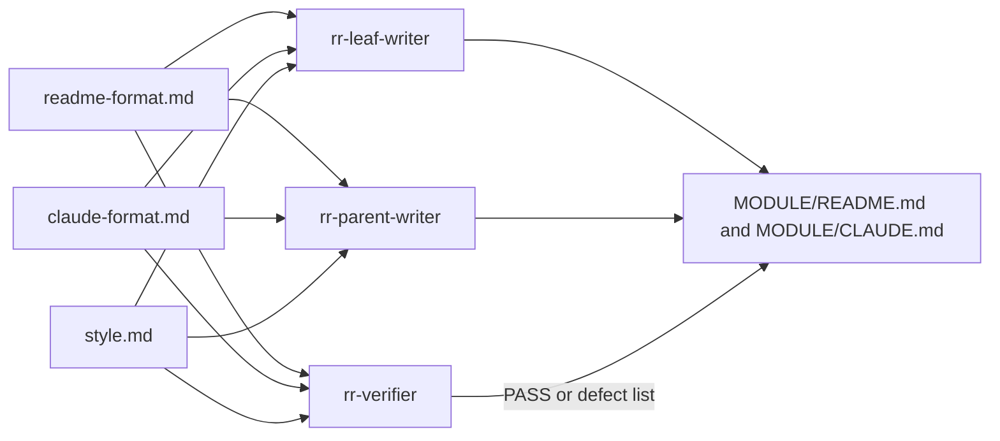

# references

This folder, at `src/references/` in the Repo Remap repo, holds the three format and style rule files that the Repo Remap skill's writer and verifier agents read before they write or check any module doc. Repo Remap is a Claude Code skill that rebuilds a repo's docs bottom-up as a `README.md` (for people) and a `CLAUDE.md` (for Claude) in every module.

## What it is for

The skill splits its work across subagents: `rr-leaf-writer` writes docs for leaf modules, `rr-parent-writer` writes docs for parent modules, and `rr-verifier` checks each result. All three need the same rules for what a good doc looks like. Keeping those rules in one place means every agent follows the same template and the same style, and changing a rule means editing one file.

## How it works



Each agent is told to read all three files fully before it starts. The files say they override anything else in the agent's instructions on matters of format.

## Files

- `readme-format.md` - template for a module `README.md`: a one or two sentence intro, then "What it is for", "How it works", "Files", "How to use it", "Things to know". Written for a person new to the code. Empty sections are dropped and length follows the module.
- `claude-format.md` - template for a module `CLAUDE.md`: title, `Path:` and `Purpose:` lines, then Scope, Architecture, Key files, Public interface, Data shapes, Invariants and constraints, Dependencies, Failure modes, Working here. Target about 200 lines, hard ceiling 300.
- `style.md` - self-containment rules (each doc must work alone, no pointers to other docs, repeat needed context, define local terms) and style rules (plain language, no emojis, no em dashes, no preamble or closing summary, Mermaid allowed, never invent behavior).

## How to use it

You do not run anything here. To change how generated docs look, edit the matching file, then from the repo root run:

```bash
make validate
make test
```

`make validate` confirms that every `references/<name>.md` cited in `src/SKILL.md` or in `src/agents/*.md` exists here. To check what ships, run `make build` and look in `build/repo-remap/references/`; it should hold only the three rule files.

## Things to know

- File names must be lowercase letters, digits, `-` or `_`, ending in `.md`. The citation checks only match names of that shape.
- Only the three rule files ship. This `README.md` and the `CLAUDE.md` next to it are docs for this repo, not part of the skill. The Makefile's `REFERENCE_FILES` list and `build.ps1`'s `Get-ReferenceFiles` both take every `*.md` here and leave those two out.
- That list is what `make build` copies into `build/repo-remap/references/`, what `make sync-skill` copies into `~/.claude/skills/repo-remap/references/`, and what gets inlined into the combined single-file build.
- `make sync-skill` deletes every `*.md` in the installed `references/` folder, copies the list in, then compares each listed file with its installed copy one by one. It fails if the installed folder holds any file name not on the list.
- A new rule file added here ships automatically. Do not name one `README.md` or `CLAUDE.md`.
- `python3 src/scripts/check_agent_wiring.py` counts every `*.md` in this folder, so its PASS line says 5 references, not 3.
- Renaming or removing a file breaks `make validate` if `src/SKILL.md` or an agent still cites the old name.
