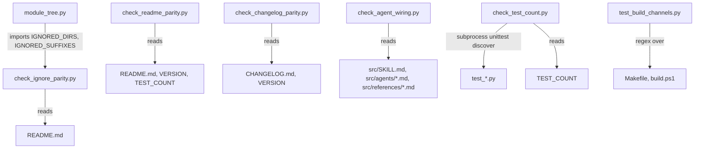

# scripts

Path: `src/scripts`
Purpose: The module mapper that ships with the Repo Remap skill, plus the dev-only parity and wiring gates and unittest suites that keep the repo consistent.

## Scope

Repo Remap is a Claude Code skill that regenerates a repo's docs bottom-up as self-contained `README.md` and `CLAUDE.md` files. This directory holds all of its Python code.

- Shipped: `module_tree.py` only. It is the one script copied into the build, the package and the local install.
- Dev-only: `check_*.py` (gates) and `test_*.py` (suites). They must never ship or sync.
- Not here: the protocol text (`src/SKILL.md`), the agent definitions (`src/agents/rr-*.md`), the format references (`src/references/*.md`), the build channels (`Makefile`, `build.ps1` at repo root), `VERSION`, `TEST_COUNT`, `CHANGELOG.md`, `README.md` (repo root).

## Architecture



All gates share one shape: pure functions returning a dict with `ok` or diff lists (`check_agent_wiring` returns a list of `(tag, message)` defects), a `run(root: Path) -> int` that reads files and prints, and `main(argv=None) -> int` that takes an optional root argument and defaults to `Path(__file__).resolve().parents[2]` (the repo root). Importing a gate has no side effects.

Output lines: `PASS <detail>` or `FAIL [<tag>] <detail>`. Exit 0 on pass, 1 on any failure.

## Key files

| File | Role | Notes |
| --- | --- | --- |
| `module_tree.py` | Module mapper CLI | Shipped. Read-only. `IGNORED_*` sets are imported by `check_ignore_parity.py` |
| `check_readme_parity.py` | Gate, run by `validate` | Whole shields.io badge regexes, never substring |
| `check_changelog_parity.py` | Gate, run by `validate` | Missing or unparseable CHANGELOG is FAIL |
| `check_ignore_parity.py` | Gate, run by `validate` | Adds its own dir to `sys.path` to import `module_tree` |
| `check_agent_wiring.py` | Gate, run by `validate` | Reads `src/SKILL.md`, `src/agents/`, `src/references/`. Never in `test` target |
| `check_test_count.py` | Gate, run by `test` only | Re-runs the full suite in a subprocess |
| `test_module_tree.py` | 18 tests | Builds temp trees with `make_tree(root, {rel_dir: [files]})` |
| `test_check_readme_parity.py` | 12 tests | Includes live-repo test |
| `test_check_changelog_parity.py` | 10 tests | Includes live-repo test |
| `test_check_ignore_parity.py` | 11 tests | Includes live-repo test |
| `test_check_agent_wiring.py` | 13 tests | Builds a temp `src/` with `agent_text(...)`; includes live-repo test |
| `test_check_test_count.py` | 11 tests | Mocks `run_suite`, never recurses |
| `test_build_channels.py` | 27 tests | Reads `Makefile` and `build.ps1` at import time. Classes `Targets` (5), `Gates` (7), `AgentsAndReferences` (9), `RepoDocsExcluded` (5), `CombinedNote` (1) |

Total 102, which must equal `TEST_COUNT` at repo root.

## Public interface

### module_tree.py

CLI: `python3 module_tree.py <root> [--min-files N] [--ignore DIR ...]`

- `--min-files` int, default 2. Dirs with `count <= N` direct files and no qualifying child are skipped.
- `--ignore` extra dir names, matched by basename at any depth. Applied by `IGNORED_DIRS.update(args.ignore)`, which mutates the module global.
- Exit 1 with `not a directory: <abs>` on stderr if root is not a dir; 0 otherwise.

Functions:

- `is_ignored_dir(name: str) -> bool`: `name in IGNORED_DIRS`, or starts with `.` and is not `.github`.
- `is_counted_file(name: str) -> bool`: False for `IGNORED_FILES`, any dotfile, or a name ending in `IGNORED_SUFFIXES`.
- `scan(root: str) -> dict[str, tuple[int, list[str]]]`: `{dirpath: (direct_file_count, sorted_child_dir_paths)}` via `os.walk`, pruning ignored dirs in place. Paths are `os.path.join` strings rooted at `root`.
- `qualifying(tree: dict, root: str, min_files: int) -> set[str]`: processes paths by `os.sep` count descending; a path qualifies if `count > min_files` or any child qualifies. Root is added unconditionally. Then drops any path whose subtree (itself plus `startswith(p + os.sep)`) has zero counted files.
- `main() -> int`: parses `sys.argv`.

Output format:

```
repo root: <abs root>
qualifying modules: <n>   skipped dirs: <m>

PROCESSING ORDER (deepest first)

-- depth <d> --
  <rel path padded to 60> files=<count padded to 4> leaf|parent of <k>[ [README|CLAUDE|README+CLAUDE]]
-- root --
  .  ...

SKIPPED (documented by nearest qualifying ancestor)
  <rel path> files=<count>
```

Depth is the number of `/` in the relative path (`src` is depth 0, `src/scripts` depth 1); the root is grouped under `-- root --`. `parent of k` counts only qualifying direct children. The SKIPPED block is printed only when non-empty; `m = len(tree) - len(quals)` includes empty scaffolding dirs.

### Gates

| Gate | Pure functions | FAIL tags |
| --- | --- | --- |
| `check_readme_parity` | `check_version_badge(text, version) -> {ok, found, readme, expected}`, `check_test_badge(text, count)` same shape | `readme-parity-io`, `readme-version-badge`, `readme-test-badge` |
| `check_changelog_parity` | `top_entry(text) -> (version, date) or None`, `check(text, version) -> {ok, entry, expected}` | `changelog-parity-io`, `changelog-parity` |
| `check_ignore_parity` | `extract_paragraph(text) -> str`, `compare(text, dirs=IGNORED_DIRS, suffixes=IGNORED_SUFFIXES) -> {paragraph_found, dotted_sentence, too_few, missing_dirs, missing_suffixes, unknown}` | `ignore-parity-io`, `ignore-parity-floor`, `ignore-parity-dotted`, `ignore-parity-missing`, `ignore-parity-unknown` |
| `check_agent_wiring` | `parse_frontmatter(text) -> dict or None`, `spawn_list(tools_value) -> list or None`, `has_agent_tool(value) -> bool`, `check(agents, cited_texts, references) -> list[(tag, msg)]` | `agent-wiring-io`, `agents-missing`, `agent-frontmatter`, `worker-can-spawn`, `orchestrator-wiring`, `dangling-agent`, `dangling-reference`, `verifier-model` |
| `check_test_count` | `parse_summary(output) -> {ran: int or None, ok: bool}`, `run_suite(root) -> str` | `test-count-io`, `test-count-unavailable`, `test-count-suite`, `test-count-drift` |

All five expose `run(root: Path) -> int` and `main(argv=None) -> int`.

### check_agent_wiring rules

`run` reads `src/SKILL.md` (FAIL `agent-wiring-io` if unreadable), requires `src/agents/` (FAIL `agents-missing`), loads `agents = {stem: text}` from `src/agents/rr-*.md`, `cited = {"SKILL.md": ..., "agents/<name>.md": ...}` from `src/agents/*.md`, and `references` = stems of every `src/references/*.md` (empty set if the dir is absent). The gate does not filter: `README.md` and `CLAUDE.md` in `src/agents/` are scanned for citations, and `README`/`CLAUDE` stems in `src/references/` count as references (the PASS line's reference count includes them). `check` then reports:

- `agents-missing`: no `rr-*.md` files (returns immediately).
- `agent-frontmatter`: no leading `---` block, any of `REQUIRED_KEYS = ("name", "description", "tools", "model")` empty or missing, or `name` differs from the file stem.
- `worker-can-spawn`: any agent other than `rr-orchestrator` whose `disallowedTools` does not contain the word `Agent`.
- `orchestrator-wiring`: `agents/rr-orchestrator.md` missing, its `tools` has no `Agent(...)`, `Agent(...)` names a missing agent, or an existing `rr-*` agent is not listed.
- `dangling-agent`: a cited text contains `agents/rr-<x>.md` or `subagent_type: "rr-<x>"` / `subagent_type="rr-<x>"` for a missing agent.
- `dangling-reference`: a cited text contains `references/<x>.md` for a missing reference.
- `verifier-model`: `rr-verifier` exists and its `model` (quotes stripped) is not `sonnet`.

PASS line: `PASS agent wiring: <n> agents (<n-1> workers), <r> references, <c> files scanned`.

## Data shapes

- `IGNORED_DIRS` (set): `.git .hg .svn .idea .vscode .pytest_cache .mypy_cache .ruff_cache __pycache__ node_modules bower_components vendor venv .venv env .env virtualenv dist build out target .next .nuxt .svelte-kit coverage .coverage .terraform .gradle .tox .cache site-packages .DS_Store`.
- `IGNORED_FILES` (set): `README.md CLAUDE.md .DS_Store .gitkeep`. Not checked by any gate.
- `IGNORED_SUFFIXES` (tuple, used with `str.endswith`): `.pyc .pyo .class .o .so .dll .dylib .log .lock .map .min.js .min.css .snap`.
- Version badge regex: `!\[[^\]]*\]\(https://img\.shields\.io/badge/Skill-v(\d+\.\d+\.\d+)-[^)]*\)`.
- Tests badge regex: `!\[[^\]]*\]\(https://img\.shields\.io/badge/tests-(\d+)%20passing-[^)]*\)`.
- Changelog heading regex (multiline): `^## \[(\d+\.\d+\.\d+)\] - (\d{4}-\d{2}-\d{2})\s*$`. `## [Unreleased]` never matches.
- Ignore paragraph: the first `\n\n`-separated block whose left-stripped text starts with `**Ignored by default**`. Names are every backticked span. Must contain the exact sentence `Dotted directories are skipped except `.github``. `MIN_NAMES = 10`.
- Agent frontmatter parse (`parse_frontmatter`): regex `\A---[ \t]*\r?\n(.*?)\r?\n---`; `key: value` lines start a field; indented or `- ` continuation lines are appended to the previous key with a space, so folded `description: >` values and YAML lists survive as one string.
- Unittest summary: `^Ran (\d+) tests? in ` and a final `^OK( \(...\))?\s*$` line (`OK (skipped=1)` counts as OK).

## Invariants and constraints

- `module_tree.py`: standard library only, Python 3.8+, never writes files.
- Qualifying rule is strictly greater than `min_files`. `src/SKILL.md` Definitions and the repo README restate it; keep them in step.
- `IGNORED_DIRS` and `IGNORED_SUFFIXES` must match the README "Ignored by default" paragraph: every non-dotted dir and every suffix backticked, nothing unknown backticked (`.github` is allowed). Dotted dirs may be omitted.
- Badge checks must stay whole-badge regexes. Do not loosen to substring matches; tests assert a bare `Skill-v1.2.3-green.svg` or `tests-42%20passing` is not found.
- A missing `CHANGELOG.md` or `README.md` is FAIL, never skip.
- `check_test_count.py` belongs to the `test` target only, never `validate` (enforced by `test_build_channels.py`).
- Gates must stay importable without side effects; tests import them directly.
- `check_agent_wiring.py` runs under `validate` only, never `test` (`test_validate_runs_agent_wiring_gate` enforces both channels). The `validate` loop in both channels separately greps each `src/agents/rr-*.md` (Makefile `for f in src/agents/rr-*.md`, `build.ps1` `$agents = Get-AgentFiles`) for `name`, `description`, `tools`; the gate additionally requires `model`. `test_validate_agent_frontmatter_keys_agree` pins the loop to exactly those three keys in both channels.
- Build channel file sets (pinned by `test_build_channels.RepoDocsExcluded`): agents are `AGENT_FILES := $(sort $(wildcard src/agents/rr-*.md))` and `Get-AgentFiles` (`Get-ChildItem src/agents -Filter rr-*.md -File`); references are `REFERENCE_FILES`, which `filter-out`s `src/references/README.md` and `src/references/CLAUDE.md`, and `Get-ReferenceFiles` (`Where-Object { $_.Name -notin @('README.md','CLAUDE.md') }`). `build`, `build-combined` and `sync-skill` must use these sets; an unfiltered `src/agents/*.md` or `src/references/*.md` glob is allowed only inside an `ERROR: no files match` message. Makefile `sync-skill` also fails with `ERROR: sync diff mismatch: unexpected references/<name>` if the install holds a reference not in `REFERENCE_FILES`; `build.ps1` compares the source and installed name sets. `sync-skill` installs `rr-*.md` into both `<skill install>/agents/` and `~/.claude/agents/`: it prunes `<skill install>/agents/*.md` and only `rr-*.md` in the shared `~/.claude/agents/`, copies, diffs each agent file in both places, and fails with `ERROR: sync diff mismatch: unexpected agents/<name>` (Makefile) or `ERROR: sync diff mismatch: agents/` (`build.ps1`) if the skill's `agents/` holds a name not in the source set (pinned by `AgentsAndReferences.test_sync_installs_and_compares_skill_agents_dir`).
- `ORCHESTRATOR = "rr-orchestrator"`, `VERIFIER = "rr-verifier"`, `VERIFIER_MODEL = "sonnet"` are hard-coded. Renaming either agent means changing these constants and `test_check_agent_wiring.WORKERS`.
- `test_module_tree.Cli` saves and restores `mt.IGNORED_DIRS` in `setUp`/`tearDown` because `--ignore` mutates it. Any new test calling `main()` with `--ignore` needs the same guard.

## Dependencies

- Standard library only: `argparse`, `os`, `sys`, `re`, `subprocess`, `pathlib`, `unittest`, `unittest.mock`, `tempfile`, `io`, `contextlib`.
- `check_ignore_parity.py` imports `module_tree` from the same directory via `sys.path.insert(0, <this dir>)`. Test files do the same for their gate.
- Repo-root files read: `README.md`, `VERSION`, `TEST_COUNT`, `CHANGELOG.md`, `Makefile`, `build.ps1`. `check_agent_wiring.py` also reads `src/SKILL.md`, `src/agents/*.md`, `src/references/*.md`.

## Failure modes

- Unreadable root file: gate prints `FAIL [<gate>-io] <OSError>` and returns 1.
- `TEST_COUNT` not an integer: `FAIL [test-count-io]`.
- Suite crashes or prints no summary: `FAIL [test-count-unavailable]`; failures: `FAIL [test-count-suite]`; count mismatch: `FAIL [test-count-drift]`.
- `test_build_channels.py` reads `Makefile` and `build.ps1` at import; if either is missing, the module fails to import and discovery reports an error.
- Live-repo tests (`test_live_repo_passes` in four suites: readme, changelog, ignore, agent wiring) fail whenever the real README badges, `VERSION`, `CHANGELOG.md`, ignore paragraph or agent/reference wiring drift, even if the code under test is correct.
- The suite prints `FAIL [...]` lines to stdout from tests that exercise failing gate paths (the `Cli` cases in `test_check_readme_parity`, `test_check_changelog_parity`, `test_check_ignore_parity` and `test_check_test_count` call `main` without capturing stdout; `test_check_agent_wiring` captures it). They are expected; judge the run by the final `OK`.
- `module_tree.qualifying` drop step is O(n^2) over scanned dirs; slow on very large trees.

## Working here

- Adding or removing a test: run `python3 -m unittest discover -s src/scripts -p "test_*.py"`, write the `Ran N tests` number to `TEST_COUNT`, update the README tests badge, and update the per-suite counts in this file and `README.md` (count one suite with `python3 -m unittest src/scripts/<suite>.py`). `make test` enforces only the total.
- Changing how either build channel selects `src/agents/` or `src/references/` files: change `AGENT_FILES`/`REFERENCE_FILES` in `Makefile` and `Get-AgentFiles`/`Get-ReferenceFiles` in `build.ps1` together; `RepoDocsExcluded` asserts the exact expressions.
- Adding a script file: add it to the lint list in both `Makefile` (`lint` target) and `build.ps1` (`$LintFiles`). `test_build_channels.test_lint_lists_agree` requires both lists to equal the live `src/scripts/*.py` set.
- Adding a gate to `validate`: add it to both `Makefile` `validate` and `build.ps1` `Invoke-Validate`, never wrapped in `Test-Path` in PowerShell. `test_validate_runs_same_gates` compares the two sets.
- Changing `IGNORED_DIRS` or `IGNORED_SUFFIXES`: update the README "Ignored by default" paragraph (gated) and the Definitions list in `src/SKILL.md` (not gated).
- Never add a new shipped script without changing `SCRIPT_FILES` in `Makefile` and `$ScriptFiles` in `build.ps1`; `test_shipped_scripts_exclude_tests_and_gates` pins both to `module_tree.py` only.
- Adding, renaming or removing an agent under `src/agents/`: update the `Agent(...)` list in `rr-orchestrator.md` tools, give workers `disallowedTools: Agent`, then run `python3 src/scripts/check_agent_wiring.py`.
- New gate: follow the existing shape (pure check function, `run`, `main(argv=None)`, `PASS`/`FAIL [tag]` output, default root `parents[2]`) and add a `test_check_<name>.py` with a live-repo test.
- Commands, from repo root: `make lint`, `make test`, `make validate`. Commit subjects use `[script] ...`.
