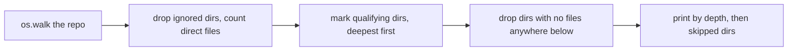

# scripts

The Python scripts behind the Repo Remap skill, in `src/scripts/` of the repo-remap repository. One script ships to users; the rest are development gates and their tests.

## What it is for

Repo Remap is a Claude Code skill that rewrites a repository's docs as a tree of `README.md` and `CLAUDE.md` files, working from the deepest directories up to the root. Before any doc is written, something has to decide which directories get docs and in what order. `module_tree.py` does that, and it is the only script users receive.

The other scripts protect the repo that builds the skill. They check that the README badges, the changelog, the version file, the test count and the ignore lists all agree, and that the two build scripts (`Makefile` for Unix, `build.ps1` for Windows) do the same things.

## How it works

`module_tree.py` walks a directory tree, counts the source files directly inside each directory, and marks a directory as worth documenting when it has more than 2 such files or contains a directory that is. The repo root always counts. It prints those directories deepest first, which is the order the skill writes docs in.



Each `check_*.py` gate reads a few files at the repo root, compares them, prints `PASS ...` or `FAIL [tag] ...`, and exits 0 or 1. Each `test_*.py` file is a standard `unittest` suite.

## Files

- `module_tree.py` - maps a repo into modules and prints the processing order. Shipped.
- `check_readme_parity.py` - README version badge must equal `VERSION`, tests badge must equal `TEST_COUNT`.
- `check_changelog_parity.py` - first `## [X.Y.Z] - YYYY-MM-DD` heading in `CHANGELOG.md` must equal `VERSION`.
- `check_ignore_parity.py` - README "Ignored by default" paragraph must agree with the ignore lists in `module_tree.py`.
- `check_test_count.py` - runs the whole test suite and requires the pass count to equal `TEST_COUNT`.
- `test_module_tree.py` - tests for the mapper's ignore rules, qualifying logic and command line output.
- `test_check_readme_parity.py`, `test_check_changelog_parity.py`, `test_check_ignore_parity.py`, `test_check_test_count.py` - one suite per gate.
- `test_build_channels.py` - checks that `Makefile` and `build.ps1` name the same targets, gates, lint list, test command and notes.

## How to use it

Map a repository (run from anywhere, pass the repo root):

```bash
python3 src/scripts/module_tree.py .
python3 src/scripts/module_tree.py . --min-files 3
python3 src/scripts/module_tree.py . --ignore fixtures generated
```

Sample output for this repo:

```
repo root: /path/to/repo-remap
qualifying modules: 3   skipped dirs: 0

PROCESSING ORDER (deepest first)

-- depth 1 --
  src/scripts                                                  files=11   leaf

-- depth 0 --
  src                                                          files=1    parent of 1

-- root --
  .                                                            files=6    parent of 1 [README+CLAUDE]
```

Run a gate or the tests from the repo root:

```bash
python3 src/scripts/check_readme_parity.py
python3 -m unittest discover -s src/scripts -p "test_*.py" -v
```

## Things to know

- Python 3.8 or newer, standard library only. Nothing to install.
- `module_tree.py` only reads. It never writes files.
- `README.md`, `CLAUDE.md`, dotfiles and generated files (such as `.pyc`, `.lock`, `.min.js`) do not count as source files. Dotted directories are skipped, except `.github`.
- Every gate defaults to the repo root two levels above the script, or takes a root path as its first argument.
- Several tests run the gates against the real repo, so the suite fails if the repo's README, `VERSION`, `CHANGELOG.md` or `TEST_COUNT` are out of step.
- `check_test_count.py` runs the full suite itself, so it is slow compared to the other gates.
